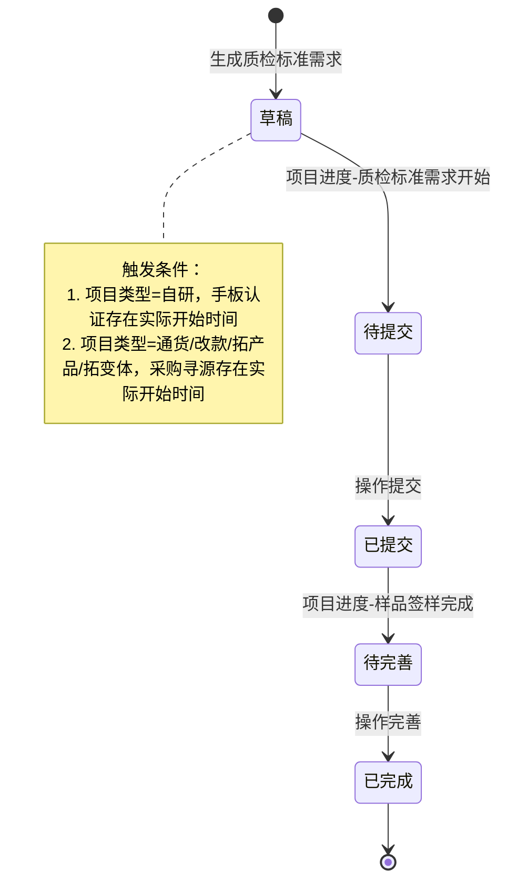

```mermaid
stateDiagram-v2
    [*] --> 草稿 : 生成质检标准需求
    note right of 草稿
        触发条件：
        1. 项目类型=自研，手板认证存在实际开始时间
        2. 项目类型=通货/改款/拓产品/拓变体，采购寻源存在实际开始时间
    end note

    草稿 --> 待提交 : 项目进度-质检标准需求开始

    待提交 --> 已提交 : 操作提交

    已提交 --> 待完善 : 项目进度-样品签样完成

    待完善 --> 已完成 : 操作完善

    已完成 --> [*]
```