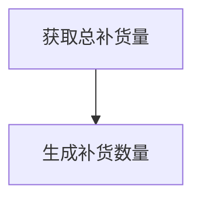
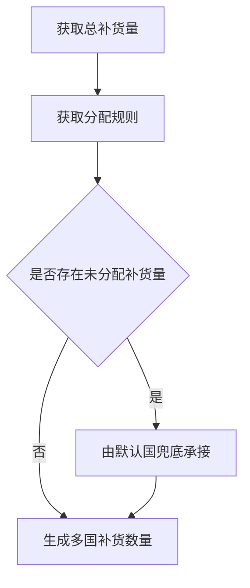

### 业务背景

伴随公司业务规模扩张与全球化布局，当下已经完成海外供应链规划，供应链体系从单一国内供应向多节点全球化供应模式转型，需要构建采购 - 补货 - 销售全链路闭环能力。
### 当前痛点/现状/场景

##### 场景1：
智能补货逻辑单一，仅支持「国内→海外」单向补货，无法适配全球化多节点供应场景；
###### 现状：
涉及全球补货的产品，计划会操作以下步骤
1. 统计ERP预测、在途、在库以及预计卖到日期，计算总补货量
2. 通过采购员获取海外/国内供应链供应商的产能、预计货好时间
3. 获取历史海外供应链发货-到货的物流时效
4. 结合上诉步骤计算出对应的拆分全球供应链应补货数量
5. 输出表格给予采购专员
###### 痛点：
线下表格维护数据量繁重，容易出错；手工表格计算会存在差异并且不容易被发现；
##### 场景2：
新品 / 老品补货逻辑不统一，缺乏标准化规则；
###### 现状：
1. 当前新品 通过“商品推广管理”中的目标数据和请购数量，项目的预计开售时间，计算出第一版首发数量。
2. 新品执行采购下单并完成首单数量导入调柜单，而后续的持续发货则由备货跟进
###### 痛点：
数据没法统一管理，分成多张表格会导致数据出现异常；在智能补货计算结果中，虽然统一计算了，但是会默认不看分级为测款的数据；计划没法得知新品采购已经导入了多少调柜单数量
### 解决问题
1. 将原有的 “国内→海外” 单向补货逻辑，优化为全球补货，适配海外仓、国内仓场景的供应链调配需求。
2. 通过系统自动化计算，替代目前线下维护、人工拆分的补货流程，减少人为错误，提升数据准确性。
3. 将供应商产能、预计货好时间、物流时效等信息通过系统计算，实现全球供应链补货数量的自动拆分，提升补货决策的效率与可靠性。
4. 将新品首发的采购下单、调柜单导入，与后续的备货跟进流程打通，实现从首发到持续补货的全流程闭环管理。
### 单/多国补货区别
补货数量的核心计算逻辑保持不变：
以「预计到货日期～计算卖到日期」区间内的库存缺口作为补货数量。
以「预计到货日期」之前的库存缺口作为紧急补货数量。

单国补货：直接计算，计算结果即为最终补货量，无需分配。

多国补货：统一时间基准，计算结果的总补货量需要根据规则分配至每个起运国
1.避免多个国家不同到货时间导致的缺口计算混乱，先算出一个 “总补货量”，再分配。
2.把总补货需求，分配到每个起运国，每个国家的分配量不能超过其「补货周期产能上限」；
3.如果所有国家产能都用完仍有需求缺口，则以出货量最大的国家作为兜底（提前做风险评估）。

### 计算流程
##### 单国家补货流程

##### 多国家补货流程

