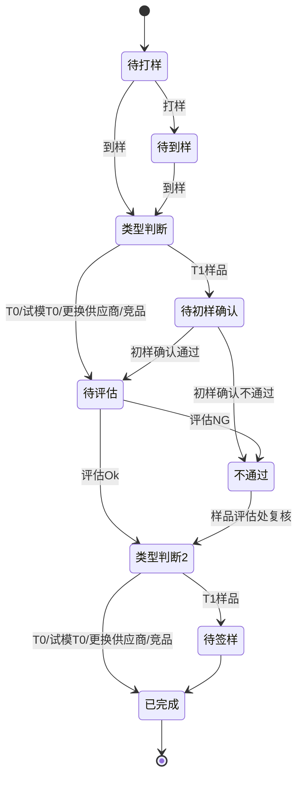

### 功能清单

| 功能类型 | 功能点              |
| ---- | ---------------- |
| 创建   | [[手动新建样品需求]]     |
|      | [[自动创建T0样品需求]]   |
|      | [[自动创建手板样需求]]    |
|      | [[自动创建试模T0样品需求]] |
|      | [[自动新建变更样品需求]]   |
|      | [[自动新建T1样品需求]]   |
| 列表   | [[查看样品需求列表]]     |
| 操作   | [[打样]]           |
|      | [[到样]]           |
|      | [[初样确认]]         |
|      | [[签样]]           |
|      | [[废弃样品需求]]       |
| 批量操作 | [[打样、到样、初样确认]]   |
|      | [[分配打样负责人]]      |
|      | [[列表导出]]         |
|      | [[打样附件下载]]       |

### 流程说明

### 不同状态的不同操作流程

| 明细状态  | 可执行的操作 | 操作说明                   |
| ----- | ------ | ---------------------- |
| 待打样   | 打样     |                        |
|       | 废弃     | 只有非T1类型的才展示废弃按钮，T1的不展示 |
| 待到样   | 到样     |                        |
| 待初样确认 | 初样确认   |                        |
| 待评估   |        |                        |
| 待签样   | 签样     |                        |
| 已签样   | -      |                        |
| 样品不通过 |        |                        |
