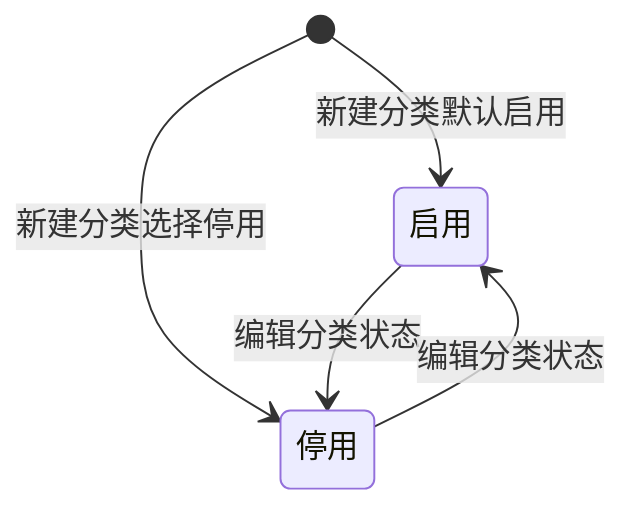

# 产品分类管理-全局说明

### 状态变更

### 状态定义

【状态】源文件弹窗展示「启用」「停用」，字段说明写作「启用」「禁用」，实际枚举文案待确定
【分类层级】当前最多三级；选择【上级分类】时最多查出至二级分类，允许关联至一级或二级分类
【上级分类】编辑时如果当前分类是二级分类，允许修改父级分类；其他情况下不允许修改
【供应商代码】仅当未选择【上级分类】时展示，若已选择【上级分类】则不展示且不保存到系统中

### 状态与操作对照

| 状态或条件 | 可执行的操作 | 说明 |
| --- | --- | --- |
| 所有分类 | 编辑、删除、拖拽排序 | 列表行操作展示「编辑」「删除」，列表支持自定义拖拽排序 |
| 存在子分类 | 展开、收起 | 存在子层级时展示展开icon；不存在子层级时不展示展开icon |
| 分类或子分类已关联产品 | 不允许删除 | 弹窗提示「分类已关联产品，请取消关联后重试」 |
| 分类及子分类无关联产品 | 允许进入删除确认 | 是否级联删除子分类待确定 |

### 通用规则

【分类名称】在顶级分类、同一父类相同层级下具有唯一性
【分类编码】一级分类编码为2位数字，按序列新增且一级分类编码不可重复；二级分类编码为2位英文字符且二级分类编码不可重复；三级分类编码规则待确定
【供应商代码】限制输入两位数值，允许出现相同的供应商代码
删除产品分类为真删
列表支持自定义拖拽排序

### 不在范围内

源文件未展开查询筛选、导入、导出、系统自动触发规则，本次不创建对应独立文档。
独立启用/停用操作未在列表中出现，仅作为新建/编辑分类字段处理。
