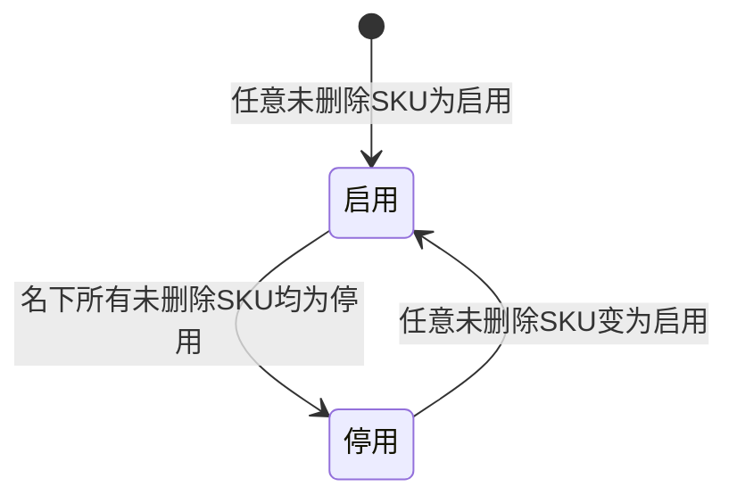

# 产品管理-Modelnumber-全局说明

### 状态变更

### 状态定义

【Model No.状态】枚举值包括「启用」「停用」
【Model No.状态】由名下未删除 SKU 的状态联动计算，名下所有 SKU 都是「停用」时为「停用」，任意一条 SKU 是「启用」时为「启用」
【SKU删除状态】列表字段和子列表均只统计或查询「未删除」SKU
【母SKU】用于初始化 Model No. 的图片、产品名称、产品分类、品牌和创建时间，母 SKU 认定规则待确定

### 状态与操作对照

| 状态或条件 | 可执行的操作 | 说明 |
| --- | --- | --- |
| 所有状态 | 详情、编辑、更多 | 列表操作列展示「详情」「编辑」「更多」 |
| 所有状态 | 删除Model No. | 源文件删除弹窗文案为「删除产品线」，删除后关联 SKU 不删除 |
| 子列表SKU | 详情、编辑、禁用、删除 | 源文件说明「编辑，禁用、删除实际上都是sku的弹窗，逻辑同sku的操作」 |
| SKU状态变更或删除 | 自动联动Model No.状态 | 触发场景包括禁用/启用 SKU、删除 SKU |

### 通用规则

【产品名称】首次等于母 SKU 的产品名称，名下 SKU 修改后同步应用至 Model No. 和名下其他 SKU，具体触发字段待确定
【产品分类】首次等于母 SKU 的产品分类，名下 SKU 修改后同步应用至 Model No. 和名下其他 SKU，具体触发字段待确定
【品牌】首次等于母 SKU 的品牌，名下 SKU 修改后同步应用至 Model No. 和名下其他 SKU，具体触发字段待确定
【Sku数】查出未删除 SKU 后统计求和
【创建时间】取母 SKU 创建时间
【子列表】查询未删除 SKU，并按创建时间升序排列

### 不在范围内

SKU 的编辑、禁用、启用和删除弹窗逻辑由「产品管理-SKU」处理，本目录只记录对子列表和 Model No.状态的影响
「新增单个」「关联产品」仅在源页作为按钮出现，未展开字段、校验或执行规则，不单独创建 PRD 文件
