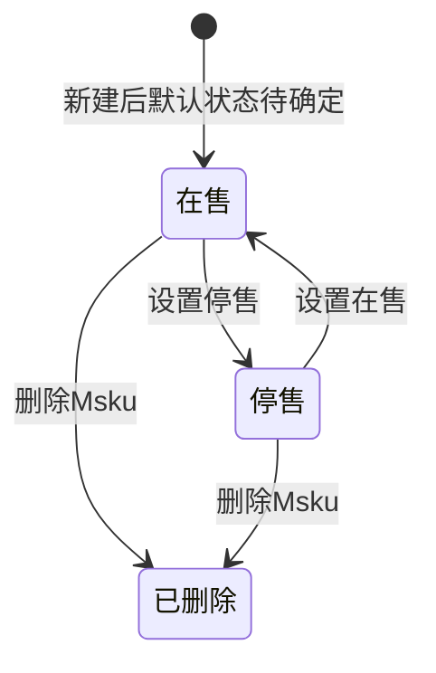

# 产品管理-Msku-全局说明

### 状态变更

### 状态定义

【商品状态】枚举值包括「在售」「停售」，列表筛选默认展示「在售」
【SKU状态】枚举值包括「启用」「禁用」，用于「设置在售」前置校验
【删除状态】删除为逻辑删除，删除后列表不可见，是否支持恢复待确定
【Msku】生成规则为二级分类的分类编码+品牌编码+四位序列号，产品管理和开发产品管理共享序列号，示例「PFUP0001」，销售平台和国家后缀生成规则待确定

### 状态与操作对照

| 状态或条件 | 可执行的操作 | 说明 |
| --- | --- | --- |
| 所有状态 | 查看、更多、导出配置 | 列表操作列展示「查看」「更多」，导出配置从列表顶部或操作入口触发，具体入口待确定 |
| 在售 | 设置停售、删除Msku、设置发货产品、编辑备注、编辑店铺、编辑开发员 | 「设置停售」后记录操作日志 |
| 停售且关联SKU为启用 | 设置在售、删除Msku、设置发货产品、编辑备注、编辑店铺、编辑开发员 | 「设置在售」前需要校验关联 SKU 状态 |
| 停售且关联SKU为禁用 | 不允许设置在售 | 提示「该Msku关联的sku目前为禁用，请先设置为启用后重试」 |
| 已删除 | 不在列表展示 | 是否可通过后台恢复待确定 |

### 通用规则

【Msku】列表按照创建时间倒序排列
【Msku】详情从列表操作列点击「查看」打开，展示产品详情页，并按 Msku 做定制展示
【Msku】详情顶部原「PLN」位置由 Msku 替换
【超重标】在详情「文件信息」页签中只展示该 Msku 目的国的数据
【条码贴纸】在详情「文件信息」页签中通过 goods id 找到 Msku 并查询贴纸数据
【操作日志】记录操作人、操作时间、操作类型、操作内容，日志示例包括新建Msku、设置在售、设置停售、编辑产品、删除
【店铺】新建或编辑时基于【销售平台】和【目的国】查询可选店铺；未选择【销售平台】或【目的国】时可选店铺为空
【店铺】已选择后如切换【销售平台】或【目的国】，需要清空已选店铺
【销售国】新建时查出所有国家，并基于【目的国】默认预填相同国家
【运营员】查出启用的运营员

### 不在范围内

「产品管理-SKU」的新建、编辑、删除、启用和禁用规则不在本目录重复定义
「编辑产品」实际打开 SKU 弹窗，SKU 字段完整规则以「产品管理-SKU」目录为准
「新增物料sku」「关联物料」「新建物料」属于产品或物料维护范围，本目录仅记录入口，不单独拆分
「产品管理-PLN」「产品管理-Modelnumber」由对应目录处理
