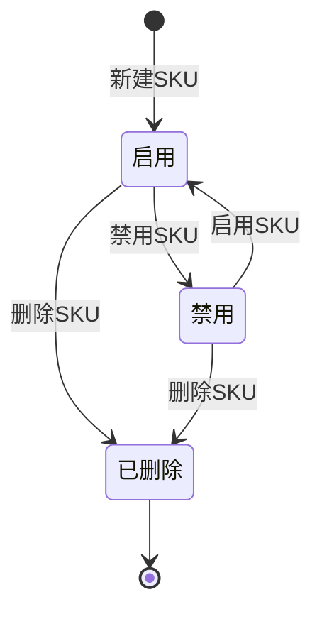

# 产品管理-SKU-全局说明

### 状态变更

### 状态与操作对照

| 状态 | 可执行的操作 | 说明 |
| --- | --- | --- |
| 所有可见状态 | 详情、编辑、删除、升级、关联MSKU、导入更新、导出 | 原型未明确限制这些操作的产品状态，具体权限与状态卡控待确定 |
| 启用 | 禁用 | 当 SKU 状态为「启用」时，按钮展示「禁用」 |
| 禁用 | 启用 | 当 SKU 状态为「禁用」时，按钮展示「启用」 |
| 已删除 | - | 删除为逻辑删除，删除后界面不可见 |

### 通用规则

【产品状态】选项为「启用」「禁用」，新建默认「启用」
【SKU】新建时自动生成，生成规则为二级分类编码+品牌编码+四位序列号，原型示例为「CCVT0001」「PFUP0001」
【SKU】不同二级分类+品牌组合的序列号单独计算，从1开始；产品管理与开发产品管理是否共享序列号以源文件说明为准，实际取号服务待确定
【Msku】生成规则为 SKU+平台两位字母+站点两位字母；同平台同站点跟卖时，在后方拼接「-序列号」，首次跟卖序列号为「1」
【Msku】商品信息中只展示原始 Msku，不展示引用的 Msku
【报关申报单价】由系统按启用供货关系更新，详见[[产品管理-SKU-系统-自动触发-更新报关申报单价]]
【清关申报单价】按目的国规则计算，清关申报单价币种为销售国本币；原币种与目标币种不同时，通过浮动汇率换算，汇率取值规则待确定
【产品包装类型】用于联动包装辅料、包装文件和部分文件信息展示
【说明书】选择「有说明书」时展示上传控件，最多上传三份文件
【包装辅料】当【产品包装类型】为「印刷牛皮纸盒」或「彩盒」时展示并置灰，支持上传最多三份文件
【图片】支持 JPG、PNG 格式，每张图片大小不超过 5M，最多上传10张
【产品物料】添加物料时查询物料类型为「产品物料」且状态为「启用」的物料
【包装物料】添加物料时查询物料类型为「包装物料」且状态为「启用」的物料

### 不在范围内

「产品包装变更」仅出现入口名称，未展开字段、校验或执行规则，本目录不创建独立 PRD 文件
「批量编辑」与「复制产品」在源文件中标记为「已废弃」，本目录不创建独立 PRD 文件
「确认新品培训」「暂停SKU」「导入新增SKU」「导入新增MSKU」未在本模块源文件中展开，本目录不创建独立 PRD 文件
供货关系、报价单、物料、辅料设计、商品维护自身生命周期不在本目录展开，仅记录与 SKU 的字段联动
