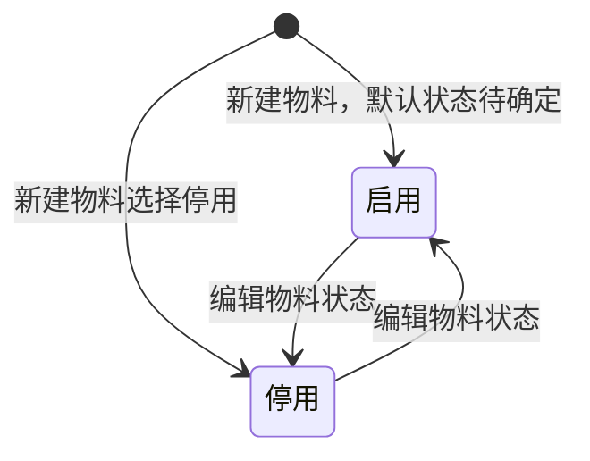

# 物料管理-全局说明

### 状态变更

### 状态定义

【物料状态】枚举值包括「启用」「停用」，用于新建物料和编辑物料，默认值待确定
【物料类型】原型字段说明写作选项「产品物料」「包装辅料」，列表示例出现「模具」，完整枚举和「包装物料」「包装辅料」文案待确定
【物料sku】系统自动生成；非模具物料按物料一级分类1位字母+二级分类1位字母+三位序列号生成，模具物料按「YH」+三位序列号生成，删除物料后的序列号不回退
【关联产品数】展示当前物料关联产品数量，关联产品数量大于0时删除物料会被拦截

### 状态与操作对照

| 状态或条件 | 可执行的操作 | 说明 |
| --- | --- | --- |
| 所有状态 | 详情、编辑、删除 | 列表行操作展示「详情」「编辑」「删除」 |
| 新建/编辑物料中 | 添加包含物料、移除包含物料 | 「移除」仅出现入口，确认方式和执行规则待确定 |
| 物料详情中 | 添加产品 | 原型展开「添加产品」弹窗，入口所在区域待确定 |
| 已关联产品 | 不允许删除 | 弹窗提示「该物料已关联产品，请取消关联后重试」 |
| 未关联产品 | 允许进入删除确认 | 删除前展示二次确认弹窗 |

### 通用规则

【物料分类】基于【物料类型】展示分类树，只能选择最子级分类
【包含物料】查出启用的物料，同时剔除当前物料，不允许物料包含自己
【图片】图片最大不能超过5m，支持bmp、jpg、jpeg格式，最多上传8张
【主图】图片最大不能超过5m，支持bmp、jpg、jpeg格式，只能上传一张
【附件】支持扩展名.rar、.zip、.doc、.docx、.pdf、.jpg等，最多上传3个文件
【产品尺寸】单位为cm，仅能输入正数，精确到小数点后两位
【重量】单位为g，仅能输入正数，精确到小数点后两位

### 不在范围内

导入、导出、系统自动触发在源文件中未展开字段、范围、校验或执行规则，本次不创建独立文档。
启用/停用只作为物料字段出现在新建/编辑弹窗中，未出现独立行操作入口，本次不创建独立启用/停用操作文档。
