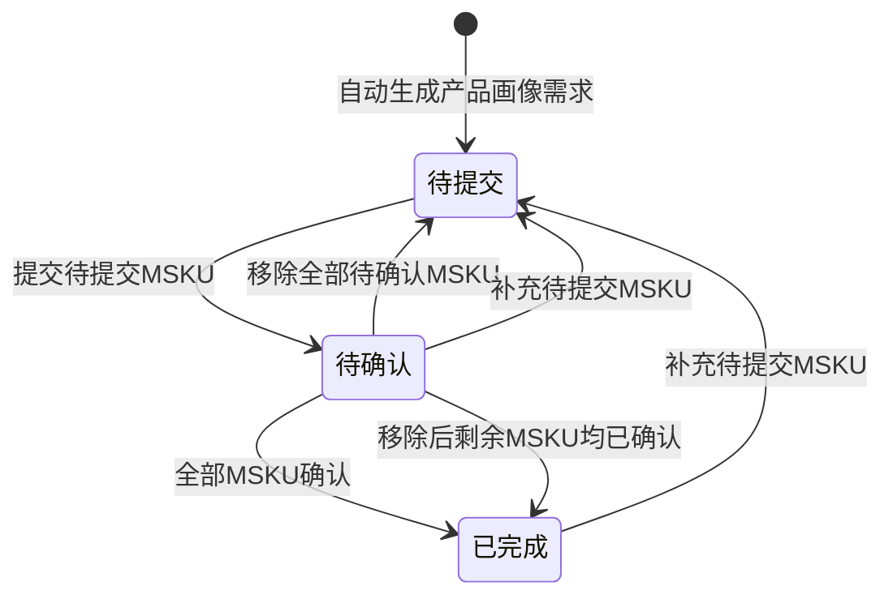

# 产品画像需求-全局说明

### 状态变更

### 状态定义

【状态】枚举值包括「待提交」「待确认」「已完成」「已废弃」
【状态】为「待提交」的条件：存在一条「待提交」MSKU，或者当前产品画像需求无MSKU
【状态】为「待确认」的条件：存在一条「待确认」MSKU，且不存在「待提交」MSKU
【状态】为「已完成」的条件：存在一条以上「已确认」MSKU，并且产品画像需求下MSKU全部确认
【状态】为「已废弃」的条件待确定，原型仅展示「已废弃」页签，未展开废弃入口、校验或执行规则

### 状态与操作对照

| 状态 | 可执行的操作 |
| --- | --- |
| 待提交 | 填写产品画像、关联MSKU、移除MSKU、提交产品画像 |
| 待确认 | 确认MSKU、全部确认MSKU、移除MSKU、补充MSKU；「提交」按钮展示口径待确定 |
| 已完成 | 补充MSKU；「提交」按钮展示口径待确定 |
| 已废弃 | 待确定 |

### 通用规则

规则：产品画像需求以项目为主对象，MSKU为明细对象。
规则：项目类型为「拓渠道」时按MSKU维度处理。
规则：项目类型为「自研」「改款」「通货」「拓变体」「拓产品」时按SKU维度处理。
规则：提交产品画像时仅处理状态为「待提交」的MSKU，已提交的MSKU不重复提交。
规则：产品画像字段编辑为即时修改，无需保存。
规则：商品节点为「待提交」「待确认」「已确认」「开发中」「请购拒绝」时允许编辑产品画像字段。
规则：MSKU发起请购后不允许编辑产品画像字段，前端不展示编辑图标；通过缓存编辑时提示「{MSKU}已发起请购，无法修改」。
规则：批量编辑时自动过滤不符合编辑规则的MSKU。
规则：当产品画像需求为「待确认」或「已完成」时补充MSKU，产品画像需求状态回退为「待提交」。
规则：「已废弃」页签存在，但废弃来源、废弃后可执行操作和恢复规则待确定。
规则：原型对「提交」按钮展示范围存在两处口径，一处为仅「待提交」展示，一处为项目状态不为「已完成」则展示，最终展示规则待确定。
