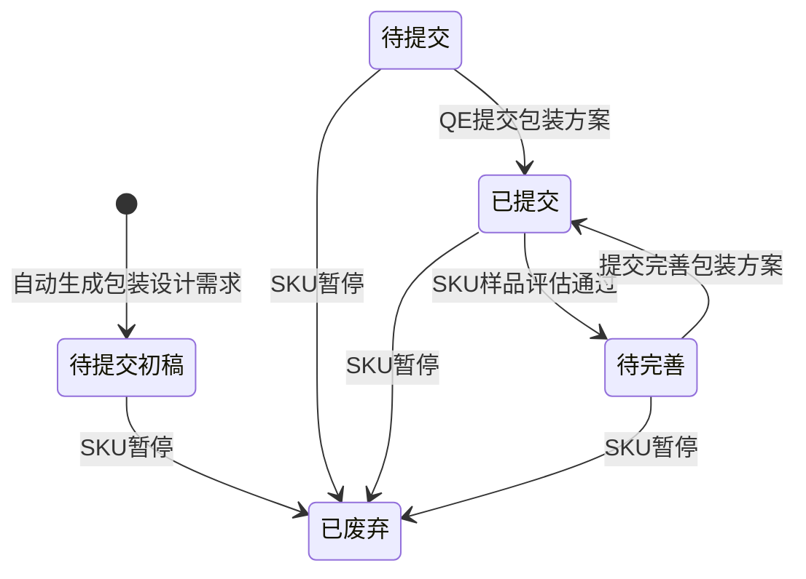

# 包装设计需求-全局说明

### 状态变更

### 状态定义

【需求状态】枚举在原型中出现「待提交初稿」「待提交」「已提交」「待完善」「已完成」「已废弃」
【需求状态】字段说明备注中出现「待提交」「已提交」「待完善」「已完善」，与列表页签「已完成」及操作说明「已完善/待推送」「已完善/已推送」不一致，最终状态枚举待确定
「待提交初稿」为系统自动生成包装设计需求后的默认状态
「待提交」为可提交包装方案的状态，只有QE可以提交成功
「已提交」为包装方案已提交的状态，已提交记录在SKU样品评估通过后自动变更为「待完善」
「待完善」为样品评估通过后需要完善包装方案的状态，提交后变更为「已提交」
「已废弃」为SKU已暂停时包装设计需求变更后的状态
「已完成」在列表页签和样例数据中出现，来源、生成条件和与「已完善」的关系待确定

### 状态与操作对照

| 状态 | 可执行的操作 | 操作说明 |
| --- | --- | --- |
| 待提交初稿 | 处理 | 「包装设计」弹窗仅展示「保存」，不展示「提交」 |
| 待提交 | 处理、包装工程师分配 | 「提交」仅QE可成功，提交后状态变更为「已提交」；包装工程师仅「待提交」可修改 |
| 已提交 | 处理 | 首次提交后「包装设计」弹窗仅展示「保存」；SKU样品评估通过后自动变更为「待完善」 |
| 待完善 | 处理 | 弹窗必填项相较待提交状态存在变更，具体差异以原型为准；提交后状态变更为「已提交」 |
| 已完善/待推送 | 处理 | 提交后仅展示「保存」，产品推送至产品库后无法再次处理 |
| 已完善/已推送 | - | 不展示操作按钮 |
| 已废弃 | - | SKU已暂停时变更为废弃，不展示操作按钮 |

### 通用规则

规则：包装设计需求以SKU为处理对象。
规则：列表除单独说明字段外，其他字段均直接查询开发SKU字段。
规则：从项目管理的项目人员中【包装工程师】预填到包装设计需求，允许为空，允许后续修改。
规则：项目已完成时不展示操作按钮。
规则：SKU已暂停时，已生成的包装设计需求变更为「已废弃」，不展示操作按钮。
规则：「批量处理」原型备注说明仅在「待提交」「已提交」页签展示，「全部」页签不展示；页面静态稿在「全部」页签展示「批量处理」，最终展示口径待确定。
规则：「待提交初稿」通过「保存」后的状态流转未在原型展开，待确定。
规则：列表右上角存在固定、历史、下载图标入口，具体字段、导出范围、历史记录或执行规则未展开，不单独创建操作或导出文档。
规则：「关联物料」「新建物料」仅作为包装物料添加入口出现，原型未展开完整页面、弹窗、字段、校验或执行规则，不单独创建操作文档。

### 不在范围内

不处理「物料管理」「包装刀模设计」「包装平面设计」「物料分类管理」页面的独立PRD。
不处理「项目管理」「项目详情-基础信息」「项目详情-进度信息」「样品需求视图」「打样明细视图」页面的独立PRD。
