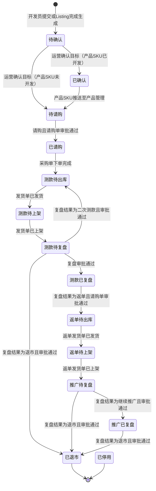

# 商品推广管理-全局说明

### 状态变更

状态变更来源包含商品节点、推广项目状态、请购审批、采购下单、发货出库、上架、复盘审批结果。
上图中「复盘审批通过」「请购单审批通过」仅表示原型已出现的通过后状态触发点，具体审批流、审批人和回写时点待确定。

### 状态与操作对照

| 状态 | 可执行的操作 | 说明 |
| --- | --- | --- |
| 所有状态 | 详情 | 列表均支持查看详情 |
| 待确认 | 目标 | 支持保存和提交目标 |
| 已确认 | 目标 | 支持保存目标 |
| 待请购 | 目标 | 支持保存目标 |
| 已请购 | 目标 | 支持保存目标 |
| 测款待出库 | 目标 | 支持保存目标 |
| 测款待上架 | 目标 | 支持保存目标 |
| 测款待复盘 | 复盘 | 支持保存复盘 |
| 测款已复盘 | - | 原型状态对照未配置可执行操作 |
| 返单待出库 | - | 原型状态对照未配置可执行操作 |
| 返单待上架 | - | 原型状态对照未配置可执行操作 |
| 推广待复盘 | 复盘 | 支持发起复盘 |
| 推广已复盘 | 复盘 | 支持再次发起复盘 |
| 已退市 | - | 原型状态对照未配置可执行操作 |
| 已停用 | - | 原型状态对照未配置可执行操作 |

### 数据维度与生成规则

【数据维度】Amazon、Walmart、Coupang按Item ID+销售国维度管理
【数据维度】TikTok、Temu按规格型号+销售国维度管理
【数据维度】其他平台按库存SKU+销售国维度管理
【进入数据条件】创建Listing页面需求为「已完成」时进入商品推广管理
【引用平台数据】如果属于引用其他平台，需要对应其他平台的创建Listing需求为「已完成」才进入商品推广管理
【被引用MSKU】当被引用MSKU完成Listing时，引用平台进入商品推广管理，被引用平台是否进入按原型特殊判断处理
【维度一致引用】如果引用MSKU和被引用MSKU数据维度一致，按引用MSKU状态展示
【维度已存在】如果被引用MSKU本身已存在，按原有状态展示，不因引用关系变更

### 审批中限制

当商品推广数据存在未完结的「复盘审批」时，列表展示「审批中」标签，不允许提交复盘，不允许提交变更商品分级，不允许提交更换商品推广信息。
当商品推广数据存在未完结的「分配运营员审批」时，列表展示「审批中」标签，不允许提交分配运营员，不允许提交更换商品推广信息。
当商品推广数据存在未完结的「变更商品分级审批」时，列表展示「审批中」标签，不允许提交复盘，不允许提交变更商品分级，不允许提交更换商品推广信息。
「审批中」标签的具体展示位置、审批单判断范围、多个审批单并存时的优先级待确定。

### 通用规则

批量操作选择多条数据时，需要校验勾选数据是否为同一销售平台；不满足提示「勾选的数据里面存在多个销售平台，只允许同」。
所有预计日期会根据项目进度持续刷新；例如出库时间延后2天时，预计测款复盘日期及后续预计返单出库、预计返单上架等日期同步延后2天。
【预计上架日期】无头程物流跟踪时取项目预计上架时间并持续更新；有头程物流跟踪时取最早物流跟踪预计上架时间并持续更新；有实际上架日期后不再更新。
【预计返单上架日期】无头程物流跟踪时按预计返单出库日期+物流时效计算；有头程物流跟踪时取头程物流跟踪预计上架时间并持续刷新。
【物流时效】从业务配置中取头程时效配置，起运地为中国，目的国为商品推广ID对应目的国，运输方式为整柜海卡或散货海卡；存在多个时效时取最短时效，取不到时取参数值「海运时效」。
【实际测款复盘日期】完成测款复盘且复盘结果为「返单」或「退市」时记录；复盘结果为「二次测款」或「继续观察」时不记录。
【实际推广复盘日期】完成推广复盘时记录。
【推广项目编号】默认空，在运营提交测款复盘阶段的复盘时生成并存入，生成规则待确定。

### 不在范围内

不生成「项目管理」「项目详情-基础信息」「项目详情-进度信息」「样品需求视图」「打样明细视图」相关PRD。
「新品请购」「加单请购」原型在本页出现完整弹窗，但业务对象疑似归属请购单；本目录仅记录入口和边界，不单独生成请购操作文档。
「商品推广项目详情-基础信息」「商品推广项目详情-进度信息」页面不在本次处理范围。

### 待确定项

「审批中」标签对应审批单类型、审批流节点、审批通过或拒绝后的精确回写时点待确定。
状态变更图中部分节点来自原型连线说明，采购、发货、上架等上游系统的具体事件字段待确定。
「无需确认」场景在原型备注中出现，适用状态和操作规则待确定。
导入目标、导入预测的数据量上限在原型中展示为「xxx条」，具体数值待确定。
