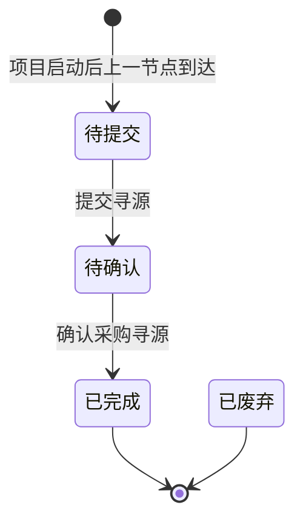

# 寻源需求-全局说明

### 状态变更

### 状态与操作对照

| 状态 | 可执行的操作 |
| --- | --- |
| 所有状态 | 详情 |
| 待提交 | 提交寻源 |
| 待确认 | 更新寻源、确认 |
| 已完成 | - |
| 已废弃 | - |

### 通用规则

列表默认按【需求创建时间】倒序排列。
当项目启动后上一节点到达时，系统生成一条采购寻源需求。
【项目名称】和【项目编号】取自项目信息。
【图片】取自项目信息。
【1688链接】取自项目信息，列表展示「查看」或「-」。
【项目类型】取自项目信息。
【新品执行采购】取自项目信息。
【采购工程师】取自项目信息。
【产品分类】取自项目信息。
【开发员】取自项目信息。
【项目经理】取自项目信息。
【项目日志】展示采购寻源节点相关项目日志数量，鼠标移入查看具体采购寻源日志。
点击【项目日志】的「+」号可添加采购寻源节点并生成置灰节点，具体字段、校验、执行规则待确定。
【合规报告】展示合规报告数量，点击后打开「合规报告」弹窗。
【质检用例】列表存在字段入口，取值逻辑、点击规则待确定。
列表右上角存在固定、历史、下载图标入口，具体字段、校验、执行规则待确定，不单独创建操作或导出文档。
从「采购寻源」流程进入后，下游包含「质检用例」「创建T0样品需求」「T0样品评估送样」等节点，具体由对应模块承接，本模块不展开。
【状态】枚举为「待提交」「待确认」「已完成」「已废弃」。
【状态】为「已废弃」的来源、触发条件、操作入口待确定。
