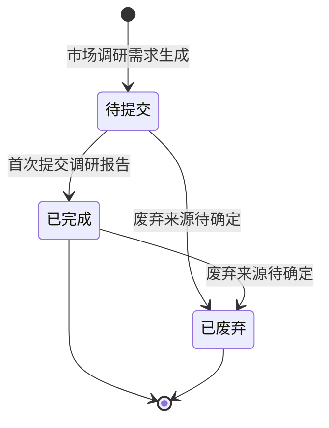

# 市场调研需求-全局说明

### 状态变更

### 状态与操作对照

| 状态 | 产品端可执行的操作 | 运营端可执行的操作 |
| --- | --- | --- |
| 待提交 | 运营员分配、提交产品端调研报告、保存产品端调研报告、提交知识产权排查入口 | 运营员分配、提交运营端调研报告、保存运营端调研报告 |
| 已完成 | 保存产品端调研报告、提交知识产权排查入口 | 保存运营端调研报告 |
| 已废弃 | - | - |

### 通用规则

本模块覆盖「产品市场调研需求」和「运营市场调研需求」两个页面，均归属「市场调研需求」业务对象。
列表按【需求创建时间】倒序排列。
【预计产品端调研完成】取项目的【实际开发时间】加业务配置的时间，业务配置项名称和具体天数待确定。
【预计运营端调研完成】取项目的【实际开发时间】加业务配置的时间，业务配置项名称和具体天数待确定。
【实际产品端调研完成】取首次提交「产品端市场调研报告」的时间，二次进入时不更新首次提交时间。
【实际运营端调研完成】取首次提交「运营端市场调研报告」的时间，二次进入时不更新首次提交时间。
当市场调研需求为「已完成」时，报告弹窗不展示「提交」，仅支持「保存」和「关闭」；原型说明中的「取消」与弹窗按钮「关闭」命名不一致，按钮命名待确定。
当项目已废弃或项目已完成时，列表不出现操作按钮。
「提交知识产权排查」仅作为联动「知识产权排查」列表或快速新建入口，具体字段、校验和执行由「知识产权排查」业务对象承接，本模块不单独生成操作文档。
流程图中「提交市场调研」后出现「产品画像需求」节点，是否自动生成「产品画像需求」、生成时机、取值逻辑和失败处理待确定，本模块不单独生成「产品画像需求」操作文档。
「已废弃」页签和状态已出现，但本模块未展开「废弃市场调研需求」的入口、字段、校验或执行规则，废弃来源和废弃后上下游处理待确定。
「项目编号」点击后新标签页打开「项目详情」，项目详情字段不在本模块范围。

### 不在范围内

不处理「项目管理」页面。
不处理「项目详情-基础信息」页面。
不处理「项目详情-进度信息」页面。
不处理「样品需求视图」页面。
不处理「打样明细视图」页面。
不单独生成「产品画像需求」业务对象 PRD。
不单独生成「知识产权排查」业务对象 PRD。
