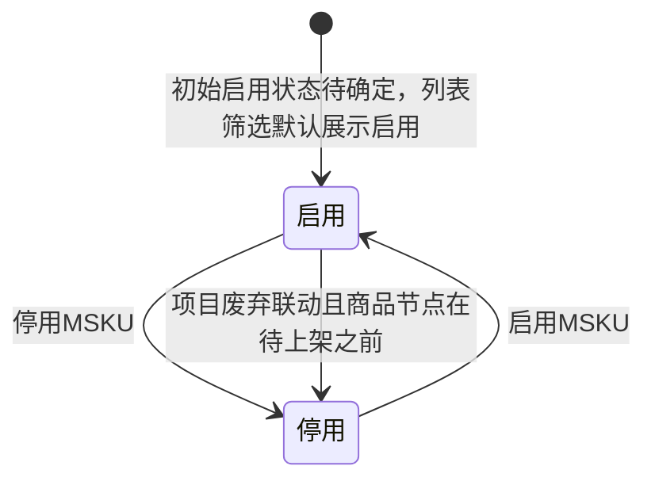

# 开发产品管理-MSKU-全局说明

### 状态变更

### 状态定义

【启用状态】枚举值包括「启用」「停用」，原型筛选默认展示「启用」，字段名称待确定
【产品状态】列表展示「待确认」「开发中」「已推送」「已暂停」，字段来源待确定
【商品节点】列表展示「待提交」「待确认」「开发中」等节点，停用判断使用「待上架之前」和「待上架及之后」，完整枚举待确定
【MSKU状态】原型在解绑项目、停用判断中使用「MSKU状态」，与列表【商品节点】的字段映射待确定
【关联项目】用于判断 MSKU 是否已绑定项目，空值表示未关联项目
【项目状态】启用判断使用「已废弃」「已完成」等状态，其他项目状态允许启用，完整枚举待确定

### 状态与操作对照

| 状态或条件 | 可执行的操作 | 说明 |
| --- | --- | --- |
| 所有状态 | 产品详情 | 列表「操作」列展示「产品详情」入口 |
| 已勾选MSKU | 关联项目、解绑项目、绑定财年 | 批量操作是否支持部分成功待确定 |
| 启用且商品节点在待上架之前 | 停用MSKU | 商品节点为「待上架」及之后时前端不展示「停用」按钮 |
| 停用且未关联项目 | 启用MSKU | 点击「启用」后标记为启用 |
| 停用且已关联项目且项目状态不是「已废弃」「已完成」 | 启用MSKU | 原型「启用判断」中前端文案写作展示停用按钮，按上下文推断为展示「启用」按钮，待确认 |
| 停用且已关联项目且项目状态为「已废弃」或「已完成」 | 不允许启用 | 点击启用时提示项目状态原因 |

### 通用规则

【Msku】列表字段来源为 MSKU 信息，原型字段写作「Msku」
【SKU】在「新建Msku」中选择【Sku/产品名称】后带出，未选择时下方商品信息为空
【销售平台】新建时查出所有销售平台，跟卖和添加销售国时按被操作 MSKU 自动带出
【目的国】新建时查出所有国家，跟卖和添加销售国时按被操作 MSKU 自动带出
【店铺】基于【销售平台】和【目的国】查询销售平台店铺，未选择【销售平台】或【目的国】时点击【店铺】为空
【店铺】已选择后如切换【销售平台】或【目的国】，需要清空【店铺】
【销售国】新建时查出所有国家，并基于【目的国】默认预填相同国家
【开发员】新建时如果登录用户角色属于开发员，则预填登录用户
【运营员】查出启用的运营员
【财年】绑定财年时查出当前财年、当前财年-1、当前财年+1，当前财年计算口径待确定
【产品状态】和【商品节点】均在列表出现，二者与启停用判断中的【启用状态】不是同一字段

### 不在范围内

「项目管理」「项目详情-基础信息」「项目详情-进度信息」「样品需求视图」「打样明细视图」不在本目录处理
「erp系统流程图」仅作为上下游参考，不单独生成 PRD 文件
「产品详情」入口在列表中出现，但本页未展开 MSKU 详情字段、校验或执行规则，不创建独立详情文档
「推送sku/Msku」「推送msku」仅在流程图中出现，未展开字段、校验或执行规则，不创建独立系统触发文档
「导入新增Msku」在 SKU 模块中作为入口出现，本目录不展开导入流程
