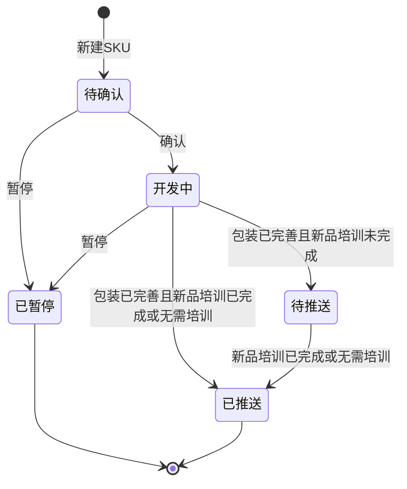

# 开发产品管理-SKU-全局说明

### 状态变更

### 状态与操作对照

| 状态 | 可执行的操作 | 说明 |
| --- | --- | --- |
| 所有状态 | 详情 | 原型列表「操作」列展示「详情」入口 |
| 待确认 | 编辑、删除、确认、暂停 | 点击「确认」后状态变更为「开发中」 |
| 开发中 | 编辑、暂停 | 原型状态操作说明展示「编辑」「暂停」 |
| 已暂停 | - | 原型状态操作说明未展示可执行操作 |
| 待推送 | - | 包装已完善时，SKU 未操作新品培训产生「待推送」状态 |
| 已推送 | - | 包装已完善且 SKU 已新品培训或无需培训后推送至产品库 |

### 通用规则

【SKU】新建时自动生成，生成规则为二级分类的分类编码+品牌编码+四位序列号，产品管理和开发产品管理共享序列号，原型示例为「PFUP0001」
【Msku】在 SKU 的「商品信息」页签选择【销售平台】和【目的国】后自动生成，生成规则为 SKU+平台两位字母+站点两位字母
【Msku】同平台同站点跟卖时，在 SKU+平台两位字母+站点两位字母后拼接「-序列号」，根据平台和国家的 Msku 跟卖次数自动往后排序，首次跟卖序列号为「1」
【Msku】跨店铺跟卖时额外增加店铺后缀，首个店铺不需要店铺后缀
【Msku】平台简称原型示例包含「AM」表示亚马逊、「TT」表示 tiktok、「WA」表示沃尔玛、「SH」表示 shein
【Msku】站点简称原型示例包含「US」表示美国、「DE」表示德国、「UK」表示英国、「CA」表示加拿大
【新品培训】SKU 状态变更为「开发中」时，系统获取项目是否有「新品培训」节点
【新品培训】项目需要新品培训时，初始默认值展示「待培训」
【新品培训】项目不需要新品培训时，列表【新品培训】展示为空
【新品培训】用户操作「无需培训」后，【新品培训】变更为「无需培训」并记录操作时间
【新品培训】用户操作「需培训」后，【新品培训】变更为「已培训」并记录培训时间
【新品培训】项目存在「新品培训」节点且 SKU 开发完、包装已完善后，如 SKU 未操作新品培训，则 SKU 不推送至产品库，直到完成新品培训操作
【新品培训】项目不存在「新品培训」节点且 SKU 开发完、包装已完善后，SKU 直接推送至产品库
【预估产品包装尺寸】仅能输入正数，最多支持两位小数，单位为「cm」
【预估产品包装重量】仅能输入正数，最多支持两位小数，单位为「g」
【预估计费重】仅能输入正数，最多支持两位小数，单位为「g」
【预估采购价】仅能输入正数，最多支持两位小数，单位为「￥」
【配送费】包含配送方式和配送费，配送方式选项为「平台配送」「自配送」，默认「平台配送」，配送费只能输入大于0的数据

### 不在范围内

「新建Msku」按钮只在本模块列表和菜单中出现，Msku 的完整新建、编辑、状态流转不在本目录展开
「导出物料清单」原型说明仅出现「导出列表+【预估采购价】」，未展开导出范围、导出字段、校验和执行规则，本目录不创建独立导出文档
「导入新增Msku」属于 Msku 业务对象边界，本目录只在待确定和重复边界中记录
