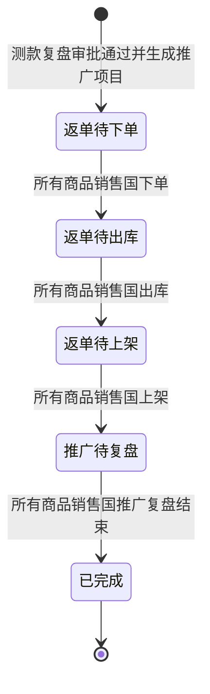

# 推广项目管理-全局说明

### 状态变更

### 状态定义

【状态】枚举值以原型列表可见为「进行中」「已完成」，字段说明提到「已废弃」但未展开废弃入口、校验或执行规则，待确定
【项目阶段】枚举值以页签和生成规则可见为「返单待下单」「返单待出库」「返单待上架」「推广待复盘」「已完成」
【项目节点】枚举值以列表可见为「待返单下单」「待返单出库」「待返单上架」「待返单复盘」，项目处于「已完成」或字段说明中的「已废弃」时展示空值
【进度状态】枚举值以原型可见为「正常」「待审批」「待制作」「待评估」「已完成」「已作废」「已逾期」，原型仅展开逾期判断口径，其他状态生成规则待确定
【任务状态】枚举值以项目进度页可见为「待开始」「进行中」「已完成」「提前完成」「已逾期」「逾期完成」

### 状态与操作对照

| 状态 | 可执行的操作 |
| --- | --- |
| 进行中 | 详情、分配人员、添加项目日志、编辑项目日志、删除项目日志、编辑节点负责角色；「更多」「复制」入口规则待确定 |
| 已完成 | 详情；是否允许分配人员、项目日志和复制待确定 |
| 已废弃 | 原型仅在字段说明中出现，操作范围待确定 |

### 通用规则

规则：推广项目由「商品推广管理」中的测款复盘数据触发生成，以一次测款复盘数据为一条推广项目。
规则：推广项目关联的商品信息仅包含复盘结果为「返单」的数据。
规则：推广项目从「返单待下单」流转到「已完成」的节点条件以所有商品销售国维度完成情况为准。
规则：「返单待下单」完成条件为所有商品销售国下单。
规则：「返单待出库」完成条件为所有商品销售国出库。
规则：「返单待上架」完成条件为所有商品销售国上架。
规则：「推广待复盘」完成条件为所有商品销售国推广复盘结束，推广商品状态为「退市」或「推广已复盘」。
规则：列表、详情基础信息、详情进度信息均属于「推广项目管理」业务对象，文档在同一目录平铺。
规则：「项目管理」「项目详情-基础信息」「项目详情-进度信息」「样品需求视图」「打样明细视图」不在本模块生成范围内。

### 待确定

【状态】中的「已废弃」来源、触发入口、是否可恢复和可执行操作待确定
【进度状态】中「正常」「待审批」「待制作」「待评估」「已完成」「已作废」的计算逻辑待确定
【任务状态】和【逾期天数】原型说明为与「项目管理」逻辑一致，具体算法待确定，本模块不展开「项目管理」页面规则
