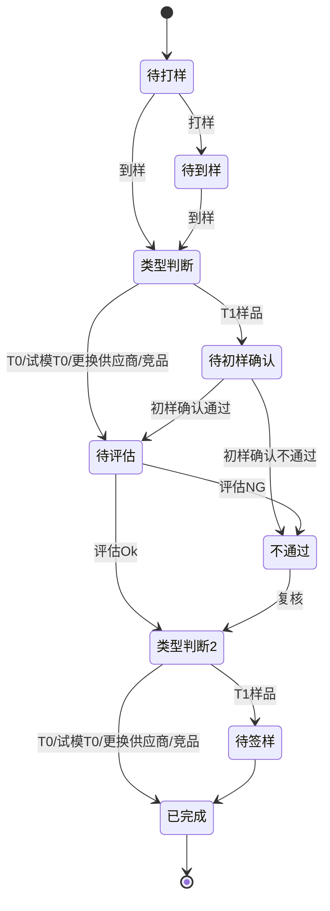

| 明细状态        | 可执行的操作 | 操作说明 |
| ----------- | ------ | ---- |
| 待打样         | 打样     |      |
| 待到样         | 到样     |      |
| 待初样确认       | 初样确认   |      |
| 待评估         | -      |      |
| 待签样         | 签样     |      |
| 已签样（完结状态）   | -      |      |
| 样品不通过（完结状态） |        |      |

样品需求明细状态变更

---

## 核心术语说明

| 术语 | 说明 |
| --- | --- |
| 打样序号 | 本打样明细的具体打样次数，按当前明细数递增（第1条为1，第2条为2，依此类推） |
| 打样编号 | 关联的样品需求编号 + 后缀 -1、-2 等，格式：{样品需求编号}-{打样序号} |
| 样品用途 | 枚举值：手板样、试模T0、T0样品、更换供应商、竞品样品 |
| 样品需求状态 | 取打样明细中序号最大的明细状态值为准 |

## 变更记录
[[样品需求管理1.0.1]]

