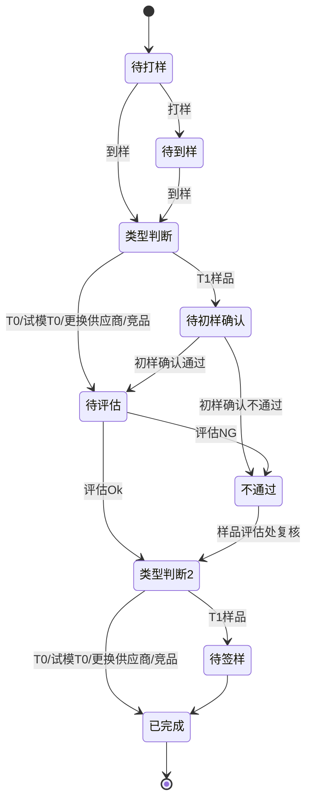

| 明细状态  | 可执行的操作 | 操作说明                   |
| ----- | ------ | ---------------------- |
| 待打样   | 打样     |                        |
|       | 废弃     | 只有非T1类型的才展示废弃按钮，T1的不展示 |
| 待到样   | 到样     |                        |
| 待初样确认 | 初样确认   |                        |
| 待评估   |        |                        |
| 待签样   | 签样     |                        |
| 已签样   | -      |                        |
| 样品不通过 |        |                        |

### 流程说明

---
