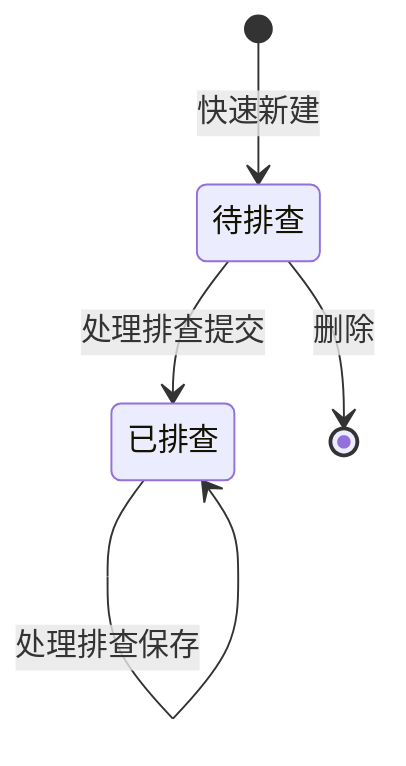

# 全局说明-知识产权排查

### 状态变更

### 状态与操作对照

| 状态 | 可执行的操作 | 操作说明 |
| --- | --- | --- |
| 待排查 | 编辑、删除、处理 | 处理弹窗首次提交后按钮只有「保存」 |
| 已排查 | 处理 | 处理弹窗首次提交后按钮只有「保存」 |
| 全部 | 待确定 | 原型存在「全部」页签入口，但未展开独立列表字段或执行规则 |

### 通用规则

「知识产权排查」列表默认按【需求创建时间】倒序排列。
「待排查(2)」「已排查」「全部」为列表页签，其中「全部」是否为业务状态待确定。
「新建知识产权排查」按钮打开「快速新建知识产权排查」弹窗，原型未提供另一个独立新建页面。
「快速新建知识产权排查」基于【查询国家】勾选值自动拆成多条知识产权排查明细，后续编辑基于明细进行单条编辑。
新建时系统判断知识产权相关的项目是否有知识产权节点，若没有知识产权节点，提示「该项目没有知识产权节点，无法新建」。
【项目】选项以项目名称+「-({项目编号})」方式拼接，仅查询状态为「进行中」的项目。
【查询国家】枚举值以原型为准，包含「EU」「UK」「US」「CA」「CN」。
【是否侵权】枚举值以原型为准，包含「是」「否」。
【侵权类型】枚举值以原型为准，包含「外观专利」「实用新型」「发明专利」。
【预计完成时间】生成来源、计算规则和是否可修改待确定。
【实际完成时间】在提交处理后如何写入待确定。
权限校验、操作日志、通知规则原型未说明，待确定。

### 不在范围内

不处理「项目管理」「项目详情-基础信息」「项目详情-进度信息」「样品需求视图」「打样明细视图」。
不单独生成「全部」页签文档，原因是原型只出现入口，未展开字段、校验或执行规则。
