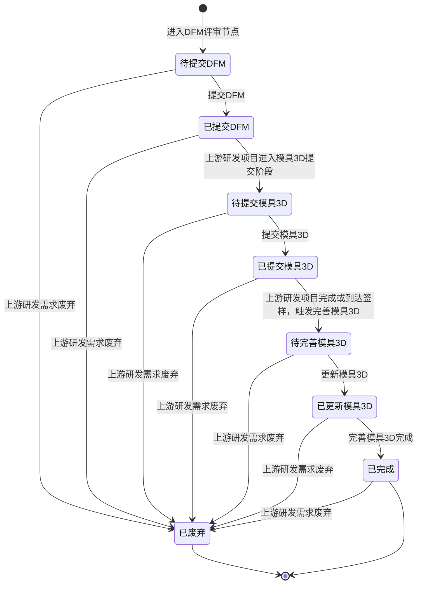

# DFM评审-全局说明

### 状态变更

### 状态与操作对照

| 状态 | 可执行的操作 |
| --- | --- |
| 所有状态 | 详情 |
| 待提交DFM | 提交DFM |
| 已提交DFM | 详情、更新DFM |
| 待提交模具3D | 详情、提交模具3D |
| 已提交模具3D | 详情、更新模具3D |
| 待完善模具3D | 详情、完善模具3D |
| 已更新模具3D | 详情 |
| 已完成 | 详情 |
| 已废弃 | 详情 |

### 通用规则

「DFM评审」用于承接研发项目在结构设计后到模具3D完善完成前的评审推进。
【研发项目】为该业务对象的上游来源，页面列表和详情均以研发项目为主索引展示。
【预计DFM评审时间】、【实际DFM评审时间】、【预计3D图纸提交时间】、【实际3D图纸提交时间】、【预计3D图纸完善时间】、【实际3D图纸完善时间】按时间轴展示，具体取值规则待确定。
页面中的「提交DFM」「更新DFM」「提交模具3D」「更新模具3D」「完善模具3D」均为独立操作入口。
当上游【研发需求】或【研发项目】废弃时，关联的「DFM评审」同步进入「已废弃」。
提交、更新和完善时涉及附件、源文件、图纸或关联对象的校验规则，原型未展开部分写「待确定」。
