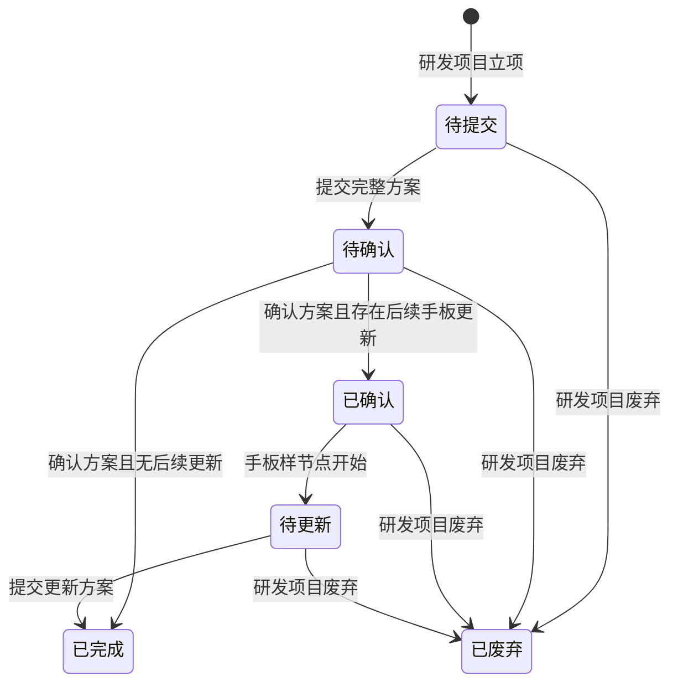

# 全局说明

### 状态变更

### 状态与操作对照

| 状态 | 可执行的操作 |
| --- | --- |
| 所有状态 | 详情、日志 |
| 待提交 | 提交初版方案、提交完整方案 |
| 待确认 | 提交初版方案、提交完整方案、确认方案 |
| 已确认 | 详情、日志 |
| 待更新 | 更新方案 |
| 已完成 | 详情、日志 |
| 已废弃 | 详情、日志 |

### 状态说明

【待提交】研发项目立项后的默认状态
【待确认】提交完整方案后的状态
【已确认】确认完整方案后，且存在后续手板样更新节点时的状态
【待更新】在手板样节点开始后，等待更新方案的状态
【已完成】确认方案或重新更新方案后的完成状态
【已废弃】研发项目被废弃后，已生成的「ID设计需求」同步变更为废弃状态

### 通用规则

「ID设计需求」由研发项目立项后进入列表，初始状态为「待提交」。
「保存」仅保存当前弹窗填写内容，不推进状态。
「提交」在通过必填和附件校验后记录实际操作人、操作时间和操作日志。
同一状态允许多次提交时，以最后一次提交内容覆盖当前方案内容，并记录最后一次提交时间。
附件上传支持扩展名以页面提示为准；原型提示为 .rar、.zip、.doc、.docx、.pdf、.jpg 等，最多上传 3 份文件。
日期字段按原型规则自动取值，不允许用户在列表或详情中手工修改。
