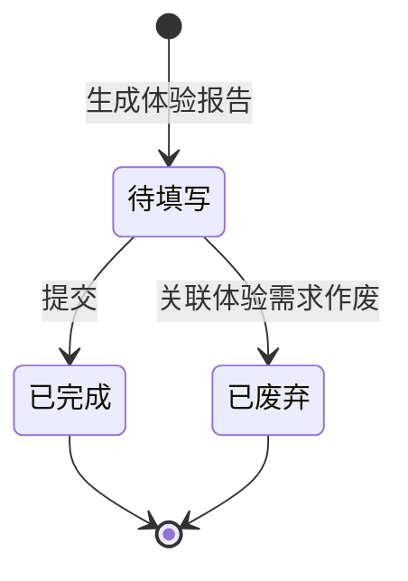

# 体验报告-全局说明

### 状态变更

### 状态与操作对照

| 状态 | 可执行的操作 |
| --- | --- |
| 所有状态 | 详情、导出 |
| 待填写 | 编辑、提交、删除 |
| 已完成 | 详情 |
| 已废弃 | 详情 |

### 通用规则

状态枚举以「体验报告」列表页为准，包含「待填写」「已完成」「已废弃」。
【单据编号】系统自动生成，生成规则待确定。
【提交时间】记录体验报告提交成功的系统时间。
【关联体验需求】体验报告必须关联一条体验需求，是否允许一对多待确定。
【体验结论】、【体验建议】、【问题记录】按原型展示，未展开的校验规则写「待确定」。

