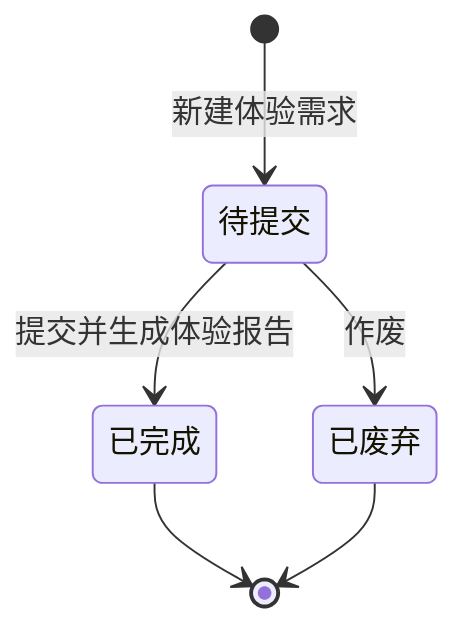

# 体验需求-全局说明

### 状态变更

### 状态与操作对照

| 状态 | 可执行的操作 |
| --- | --- |
| 所有状态 | 详情、导出 |
| 待提交 | 编辑、提交、作废 |
| 已完成 | 详情 |
| 已废弃 | 详情 |

### 通用规则

状态枚举以「体验需求」列表页为准，包含「待提交」「已完成」「已废弃」。
【单据编号】系统自动生成，生成规则待确定。
【提交时间】记录提交成功的系统时间。
【体验报告】体验需求提交后关联生成或维护体验报告，具体联动规则待确定。
原型未展开的字段校验、权限控制、重复提交处理和撤回规则均写「待确定」。

