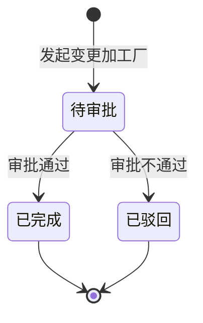

# 全局说明

### 状态变更

### 状态与操作对照

| 状态 | 可执行的操作 |
| --- | --- |
| 所有状态 | 详情、导出 |
| 待审批 | 审批 |
| 已驳回 | - |
| 已完成 | - |

### 通用规则

「加工厂变更单」由「模具管理」模具列表行「更多」中的「变更加工厂」发起，列表页不支持手工新建。
发起变更前，模具【注塑加工厂】必须不为空；为空时「变更加工厂」按钮不展示。
同一模具已存在状态为「待审批」的加工厂变更单时，不允许再次发起，提示：已存在审批中的变更单，请处理后重试。
加工厂变更单审批通过后，状态更新为「已完成」，并将模具【注塑加工厂】更新为【新注塑加工厂】。
加工厂变更单审批不通过后，状态更新为「已驳回」，不更新模具【注塑加工厂】。
审批流配置、审批人范围和消息通知规则未在原型中展开，待确定。
