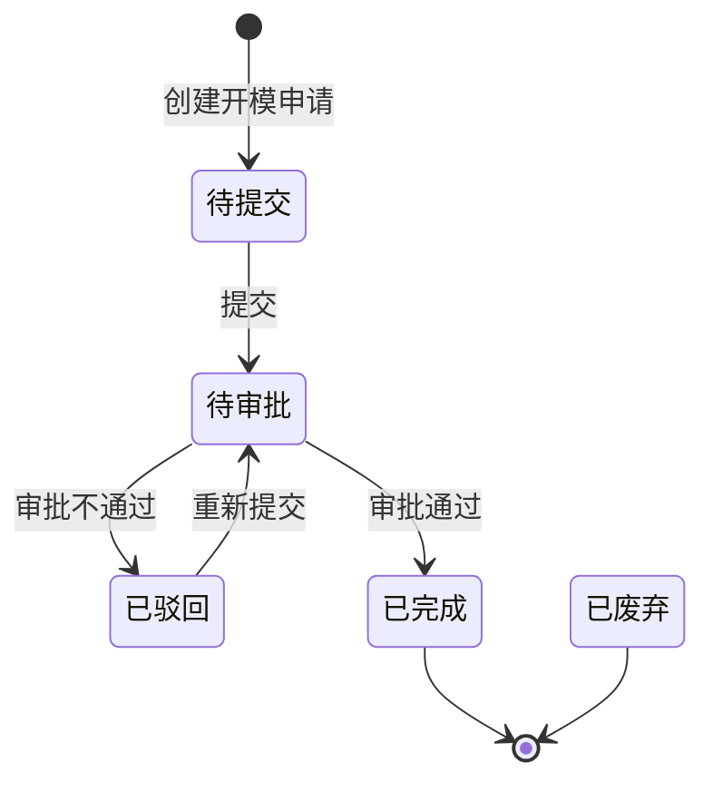

# 全局说明

### 状态变更

### 状态与操作对照

| 状态 | 可执行的操作 |
| --- | --- |
| 所有状态 | 详情、导出 |
| 待提交 | 提交 |
| 已驳回 | 提交 |
| 待审批 | 审批、催办 |
| 已完成 | - |
| 已废弃 | - |

### 通用规则

状态枚举以「开模申请」列表页签和列表状态展示为准，包含「待提交」「已驳回」「待审批」「已完成」「已废弃」。
【提交时间】记录首次提交时间，重新提交是否覆盖待确定。
【预计完成时间】按创建时间加业务配置计算，具体业务配置参数待确定。
【实际完成时间】在审批通过时写入，未审批场景的处理方式待确定。
【包装信息】、【工程bom】、【文件信息】取自关联结构设计需求或研发项目，原型中展示为只读信息。
【模具信息】在提交开模申请时补充或更新。
「审批页」作为开模申请审批动作承载页并入本业务对象，不单独建立业务对象。

