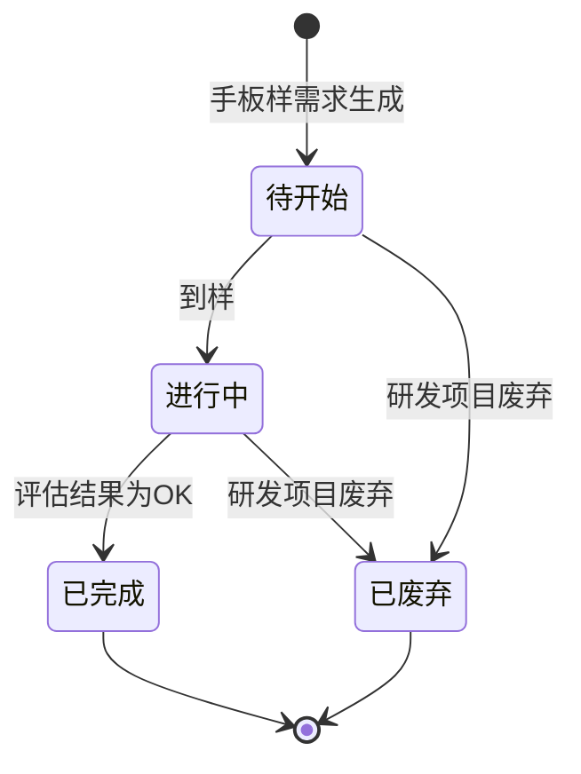

# 手板样管理-全局说明

### 状态变更

### 主表状态与操作对照

| 状态 | 可执行的操作 | 说明 |
| --- | --- | --- |
| 所有状态 | 详情 | 查看手板样需求及到样明细 |
| 待开始 | 到样 | 点击「到样」后生成一条到样明细，存在到样明细后主表状态自动变更为「进行中」 |
| 进行中 | 到样、详情 | 当打样明细均为「已完成」且评估结果均为「NG」时，允许再次到样；存在「待评估」明细时不允许再次到样；任一明细评估结果为「OK」时主表状态自动变更为「已完成」 |
| 已完成 | 详情 | 不允许新增到样或评估 |
| 已废弃 | 详情 | 研发项目废弃后联动废弃，不允许新增到样或评估 |

### 到样明细状态与操作对照

| 状态 | 可执行的操作 | 说明 |
| --- | --- | --- |
| 待评估 | 评估 | 点击「评估」打开「提交评估结果」弹窗 |
| 已完成 | - | 已提交评估结果，不允许重复评估 |

### 通用规则

【需求创建时间】取设计需求通过时间
【预计手板认证时间】按【需求创建时间】加业务配置的手板认证周期计算
【实际手板认证时间】在到样明细评估通过且主表变更为「已完成」时记录
【状态】新生成手板样需求时默认「待开始」
【状态】当研发项目被废弃且手板样需求已生成时，系统将手板样需求状态变更为「已废弃」
【打样次数】每次「到样」成功后按同一手板样需求下到样明细数量从1开始递增
【手板体验报告】按原型保留入口与展示字段，体验报告生成与管理详见「体验需求」「体验报告」业务对象
