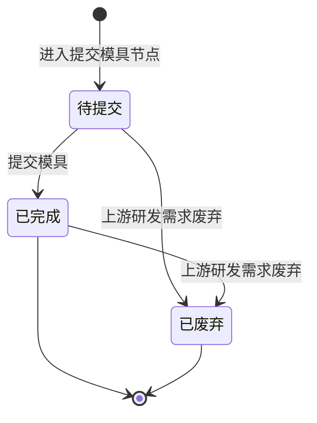

# 提交模具-全局说明

### 状态变更

### 状态与操作对照

| 状态 | 可执行的操作 |
| --- | --- |
| 所有状态 | 详情 |
| 待提交 | 提交、关联模具、新建模具、编辑模具、移除模具、查看列表 |
| 已完成 | 详情；当研发项目节点「试模」未完成时展示「提交」，当研发项目节点「试模」已完成时不展示「提交」 |
| 已废弃 | 详情 |

### 通用规则

「提交模具」用于在结构设计完成后确认工程 BOM 物料与模具信息，完成后作为「DFM评审」的上游触发来源。
【物料信息】展示结构设计提交的工程 BOM，只读展示，不在「提交模具」中新增、删除或修改物料。
【模具信息】展示当前研发需求已关联或本次新增的模具，支持「关联模具」「新建模具」「编辑」「移除」「详情」。
当【研发项目类型】为「新模」「复制模」「迭代模具」时，「模具信息」展示「关联模具」和「新建模具」，「关联模具」仅查询无研发项目且【状态】为「待制作」的模具。
当【研发项目类型】为「改模」时，「模具信息」展示「关联模具」，仅查询【状态】为「量产」的模具，并默认勾选改模研发项目中已关联的模具。
关联模具时，系统校验模具关联的物料是否均被当前【物料信息】包含。
提交模具时，系统校验是否至少存在一条模具；无模具时提示「请至少提交一个模具」。
提交成功后记录【实际完成时间】为首次提交成功时间。
涉及模具新增、编辑、删除、变更加工厂时，系统记录操作日志。

