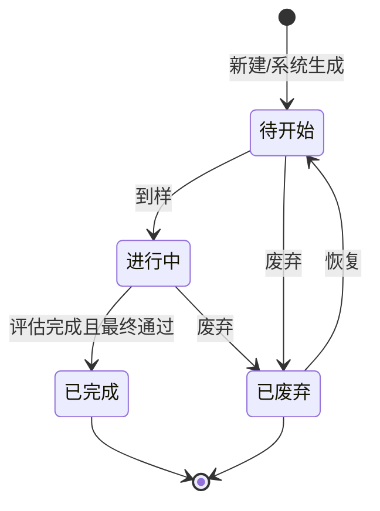

# 全局说明

### 状态变更

### 状态与操作对照

| 状态 | 可执行的操作 |
| --- | --- |
| 所有状态 | 详情 |
| 待开始 | 到样、废弃、恢复待确定 |
| 进行中 | 到样、评估、废弃、恢复待确定 |
| 已完成 | 详情 |
| 已废弃 | 详情、恢复待确定 |

### 通用规则

状态枚举以「待开始」「进行中」「已完成」「已废弃」为准。
列表按创建时间倒序排列。
列表数据来源于模具采购单审批通过后自动创建的模具样数据。
废弃的模具样恢复成待开始时，不刷新【需求创建时间】、【预计模具制作时间】。
当研发项目下所有模具都至少产生一条模具样到样数据时，研发项目节点「模具制作」记录为已完成；有模具未采购且未产生模具样时，不算模具制作完成。
当研发项目下所有模具样都评估完成并变更为已完成时，研发项目节点「试模完成」记录为已完成。
原型未展开的恢复、废弃、编辑边界规则待确定。
