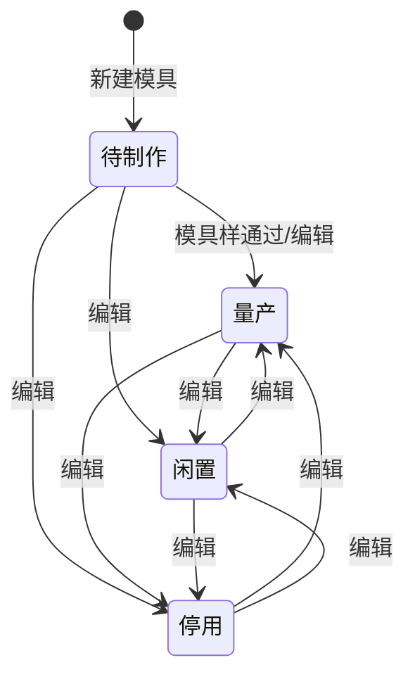

# 全局说明

### 状态变更

### 状态与操作对照

| 状态/场景 | 可执行的操作 |
| --- | --- |
| 所有状态 | 详情、日志、导出 |
| 半成品列表数据 | 新建模具 |
| 待制作、量产、闲置、停用 | 编辑、删除 |
| 模具【注塑加工厂】为空 | 不展示「变更加工厂」 |
| 模具【注塑加工厂】不为空且不存在待审批变更单 | 变更加工厂 |
| 已存在模具采购单 | 不允许删除 |
| 已存在待审批加工厂变更单 | 不允许再次发起变更加工厂 |

### 通用规则

「模具管理」页面包含「半成品」和「模具」两个列表视图；「半成品」列表可从行操作进入「新建模具」，「模具」列表可进入「详情」「编辑」「删除」「日志」「变更加工厂」。
【模具编号】由系统生成，新模/复制模/迭代模按 `YYMM+主物料+迭代序号+复制序号` 生成，实验模按 `YYMM+主物料+两位自增序列号` 生成。
同一【关联物料】下选择【模具类型】=「新模」时，只允许存在一个新模；已存在新模时再次创建提示：{物料名称}/{物料编号}下已有新模，无法多次创建。
选择【模具类型】=「复制模」或「迭代模」时，必须已存在新模；不存在新模时提示：{物料名称}/{物料编号}下没有新模，无法创建。
【日产能】按 `3600×22/成型周期×参数值(默认0.95)×模穴数` 计算。
新建模具时不维护【注塑加工厂】；当模具采购单完成试模后，系统自动取模具采购单供应商回写为【注塑加工厂】。
模具样通过后，系统自动将【状态】变更为「量产」。
加工厂变更单审批通过后，系统将模具【注塑加工厂】更新为变更单【新注塑加工厂】，并补充操作日志。
「加工厂变更单」按钮从「模具管理」跳转至「加工厂变更单」页面。
「日志」弹窗的字段未在原型中展开，待确定。
