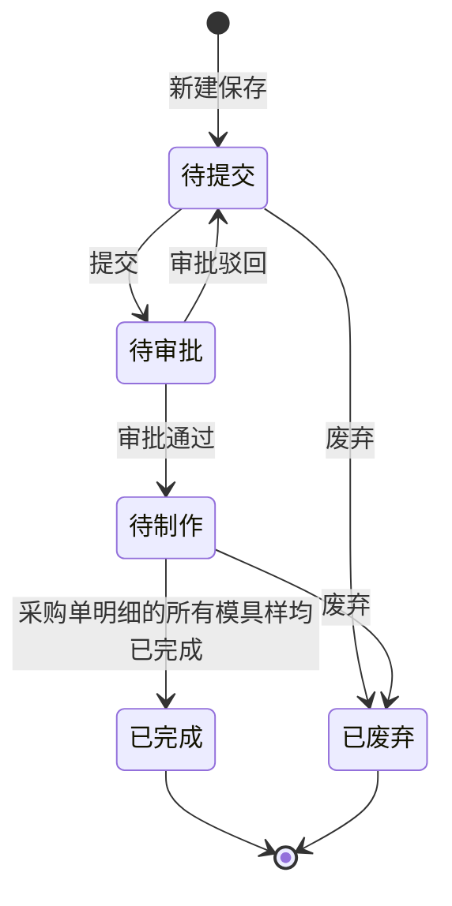

# 全局说明

### 状态变更

### 状态与操作对照

| 状态 | 可执行的操作 |
| --- | --- |
| 所有状态 | 详情 |
| 待提交 | 编辑、提交、废弃 |
| 待审批 | 详情 |
| 待制作 | 详情、废弃 |
| 已完成 | 详情 |
| 已废弃 | 详情 |

### 通用规则

「模具采购单」属于研发管理下的采购业务对象，新建、编辑、详情页并入同一业务对象目录。
【模具采购单号】为单据唯一标识，新建时展示，待确定是否自动生成。
【采购主体】新建/编辑时从供应商关联信息中预填；选择【供应商编号】后，自动预填供应商默认【采购主体】。
【采购工程师】新建/编辑时必填；若由项目自动创建，则取研发项目的采购工程师。
【采购合同】为单据关联合同信息，详情页支持「预览」。
【采购总金额】按所有采购明细的求和计算。
当「审批通过」后，单据状态变更为「待制作」，并基于模具维度生成模具样。
当「采购单明细」的所有模具样均已完成时，单据状态自动变更为「已完成」。
当执行「废弃」时，先判断单据内是否存在模具样「已到样」；若存在则提示「模具采购单内已有模具样已到样，无法废弃」。
若不存在模具样「已到样」，再判断是否有关联请款单，若存在则提示「模具采购单已有关联请款单，无法废弃」。
若均不满足上述拦截条件，则单据状态变更为「已废弃」，同时关联的模具样主表和子表状态同步变更为「已废弃」。
原型未展开的单据编号生成规则、合同生成规则、审批流转细则、字段级必填/默认/联动细节，均记为「待确定」。
