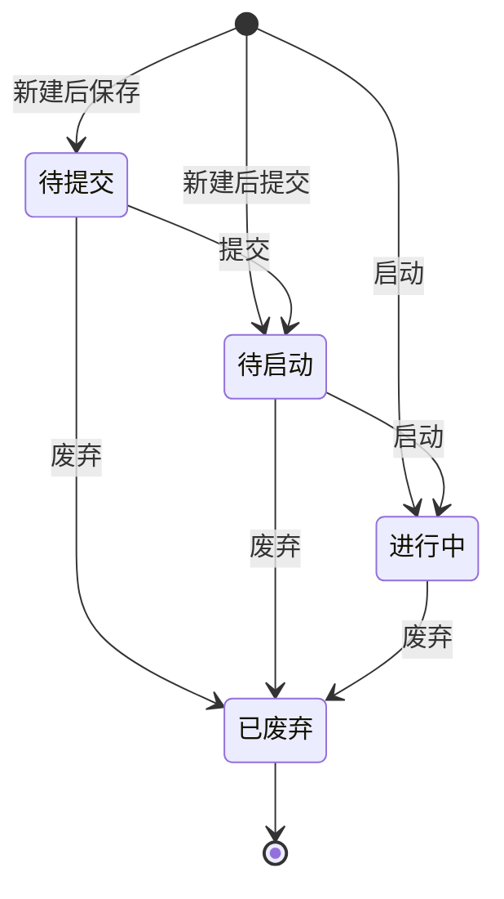

# 全局说明

### 业务范围

「研发项目」用于承接研发需求的项目主单，覆盖新建、编辑、提交、启动、废弃及详情查看。

### 状态变更

### 状态与操作对照

| 状态 | 可执行的操作 |
| --- | --- |
| 所有状态 | 详情、日志 |
| 待提交 | 编辑、提交、废弃 |
| 待启动 | 编辑、启动、废弃 |
| 进行中 | 编辑、废弃 |
| 已废弃 | - |

### 通用规则

「研发项目」从左侧「产品」菜单进入，原型未展开其他入口，待确定。

新建时页面标题为「新建研发项目」，编辑时为「研发项目详情」中的编辑态，详情页支持切换「研发项目」「ID设计」「结构设计」「手板样」「模具」「项目进度」标签，未展开标签内规则待确定。

【研发项目编号】自动生成，生成规则待确定；原型显示为必填。

【研发项目名称】必填。

【项目编号】原型中展示为字段，是否必填、是否可编辑待确定。

【项目经理】必填。

【开品负责人】、【打样负责人】为原型展示字段，取值逻辑待确定。

【设计需求】在保存态可见，提交时若原型未允许修改则按待确定处理。

保存后状态为「待提交」，提交后状态为「待启动」，启动后状态为「进行中」。

废弃后状态为「已废弃」，原型提示「废弃后也会同步废弃相关任务，无法恢复」。

原型提示研发项目启动后将自动触发相关需求，具体触发对象和生成规则待确定。

列表行支持「详情」「更多」，「更多」中出现「启动」「废弃」「日志」，具体展示条件待确定。
