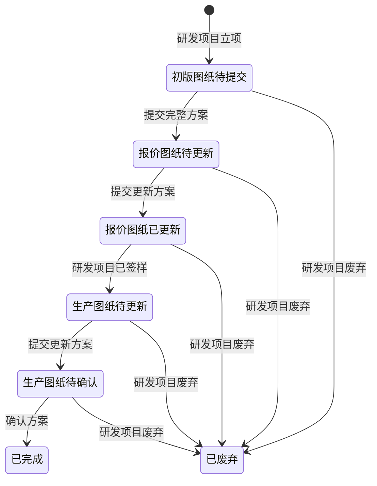

# 全局说明

### 状态变更

### 状态与操作对照

| 状态 | 可执行的操作 |
| --- | --- |
| 所有状态 | 详情、日志 |
| 初版图纸待提交 | 提交初版方案、提交完整方案、导出物料清单 |
| 报价图纸待更新 | 更新方案、导出物料清单 |
| 报价图纸已更新 | 更新方案、导出物料清单 |
| 生产图纸待更新 | 更新方案、导出物料清单 |
| 生产图纸待确认 | 更新方案、确认方案、导出物料清单 |
| 已完成 | 详情、日志 |
| 已废弃 | 详情、日志 |

### 状态说明

【初版图纸待提交】研发项目立项后的默认状态
【报价图纸待更新】提交完整方案后的状态
【报价图纸已更新】在手板样节点结束前提交更新方案后的状态，原型未展开的判定规则待确定
【生产图纸待更新】研发项目已签样后的状态
【生产图纸待确认】提交更新方案后的状态
【已完成】确认方案后的状态
【已废弃】研发项目废弃后，已生成的「结构设计需求」同步变更为废弃状态

### 通用规则

「结构设计需求」由研发项目立项后进入列表，初始状态为「初版图纸待提交」。
「保存」仅保存当前弹窗填写内容，不推进状态。
「提交」在通过必填和附件校验后记录实际操作人、操作时间和操作日志。
同一状态允许多次提交时，以最后一次提交内容覆盖当前方案内容，并记录最后一次提交时间。
附件上传支持扩展名以页面提示为准；原型提示为 .rar、.zip、.doc、.docx、.pdf、.jpg 等，最多上传 3 份文件。
日期字段按原型规则自动取值，不允许用户在列表或详情中手工修改。
原型未展开的规则，统一写「待确定」。
