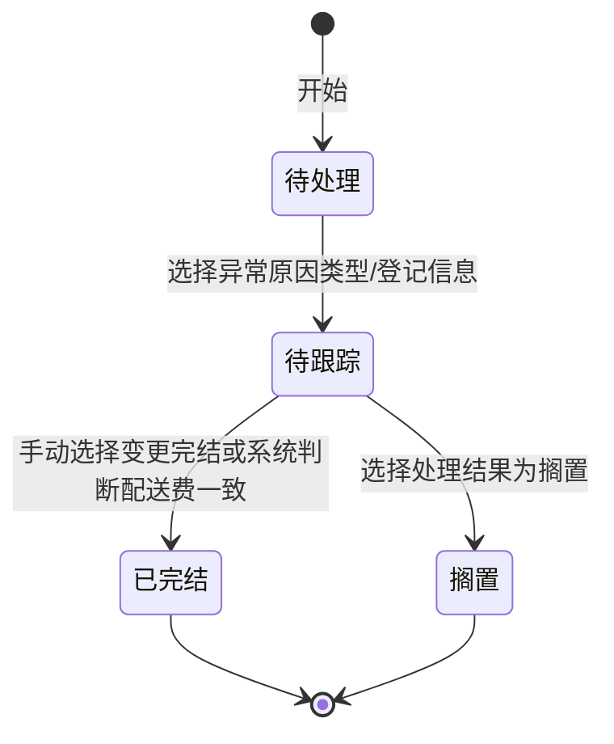

# 全局说明

### 业务范围

业务对象：FBA费差异跟进单

来源原型：「fba费差异处理流程.html」

本 PRD 仅覆盖原型中展示的FBA费差异处理流程、状态、原因类型和跟进信息，不覆盖未分配的跟进单列表页、详情页或其他模块页面。

### 适用场景

「ERP配送费标准未更新与平台一致，导致差异」。
「平台规格误测」。
「ERP规格误测」。
「平台规格填写有误」。

### 状态变更

「搁置」是否属于正式单据状态、以及进入条件待确定。

### 状态与操作对照

| 状态 | 可执行的操作 |
| --- | --- |
| 「待处理」 | 选择异常原因类型 |
| 「待跟踪」 | 登记跟进信息、选择处理结果、手动变更完结 |
| 「已完结」 | 待确定 |
| 「搁置」 | 待确定 |

### 通用规则

【异常原因类型】可选值包含「ERP规格问题」「配送费标准问题」「平台规格问题」「平台包装尺寸填写问题」
【ERP配送费】与【平台配送费】需要由系统判断是否一致，取值来源待确定
【收费档位】需要判断是否一致，取值来源和判断口径待确定
标准异常指ERP规格与平台相同、收费档位不同。
规格异常指ERP规格与平台不同、收费档位不同。
标准异常需要更新配送费标准，更新入口、权限和字段待确定。
规格异常需要判断是否为测款中产品；如果为测款中产品，需要观察后台填写规格是否与ERP相同；如果不为测款中产品，需要发起平台重测规格邮件。
平台包装尺寸填写问题需要通知运营更新尺寸，通知入口、接收人和回写规则待确定。

### 业务痛点

客服需要支持批量处理，提高工作效率。
线上跟进需要明确责任对应人和处理时效。
品质侧数据统计繁琐，当前存在多个线下表格统计。
已确认ERP尺寸存在问题时，ERP处理时效低会导致QA验货经常报异常。
异常数据存在表格重复提交问题。
品质侧希望线上化跟进进度。
包装工程师修改ERP规格时缺少品质提供的佐证，原型提到佐证包含历史入库资料、供应商/QA重测图片。

### 不在范围内

不处理未分配的「fba差异跟进单.html」页面字段。
不处理ERP配送费标准配置页面。
不处理平台邮件模板、运营后台和包装工程师修改ERP规格页面的具体字段。
