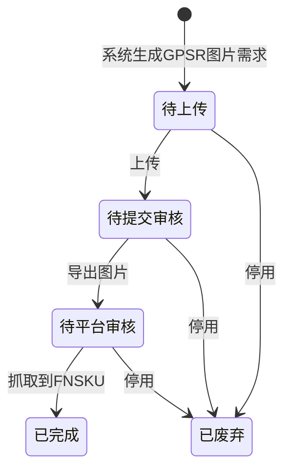

# 全局说明

### 状态变更

### 状态与操作对照

| 状态 | 可执行的操作 |
| --- | --- |
| 所有状态 | 详情、日志 |
| 待上传 | 上传 |
| 待提交审核 | 更新、导出 |
| 待提交平台 | 更新、导出 |
| 待平台审核 | 更新、导出 |
| 已完成 | 更新、导出 |
| 已废弃 | - |

### 通用规则

列表维度为【ASIN】+【目的国】，同一【ASIN】+【目的国】只生成一条「GPSR图片管理」数据。
原型中「待提交审核」和「待提交平台」同时出现，是否为同一状态待确定。
「重新启用」后，系统会将原数据重新判断当前上传图片、导出图片、是否有【FNSKU】，并回滚状态；具体回滚目标状态待确定。
「已完成」状态是否允许「更新」和「导出」按原型状态操作表展示为允许，是否受权限或平台状态限制待确定。
权限、数据范围、操作日志记录字段、重复点击处理规则待确定。
