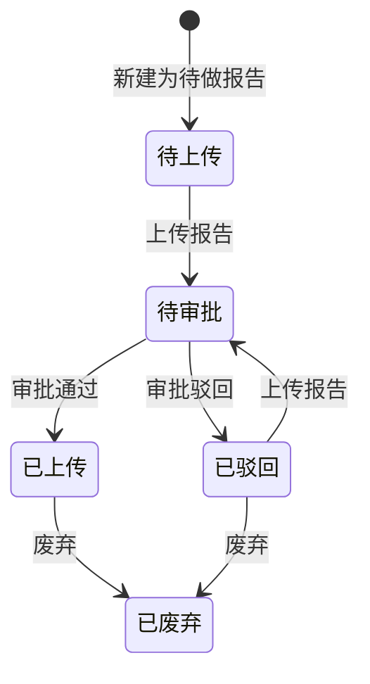

# 全局说明

### 来源范围

来源页面：「合规报告管理」「商品合规管理」中的合规报告弹窗。

### 状态变更

### 状态与操作对照

| 状态 | 可执行的操作 | 说明 |
| --- | --- | --- |
| 所有状态 | 详情、日志 | 原型明确所有状态可查看 |
| 待上传 | 上传、编辑、删除 | 原型列表操作说明出现「待处理」，页签与流转说明为「待上传」，是否同义待确定 |
| 待审批 | 详情、日志 | 审批操作在审批页完成 |
| 已驳回 | 上传、编辑、废弃、日志 | 可重新上传 |
| 已上传 | 编辑、废弃、日志 | 原型写「已完成」对应编辑和废弃，是否等同「已上传」待确定 |
| 已废弃 | 详情、日志 | 终态 |

### 通用规则

【报告状态】在新建/编辑表单中为业务录入字段，选项：「待做报告」「已做报告」「已有报告」。
【状态】为合规报告列表流转状态，选项以页签和状态流转为准：「待上传」「待审批」「已驳回」「已上传」「已废弃」。
【报告编号】保存时校验不能重复。
废弃或删除前需要校验报告是否绑定任意 Msku。
上传附件支持扩展名：「.rar」「.zip」「.doc」「.docx」「.pdf」「.jpg」等，完整扩展名范围待确定。
