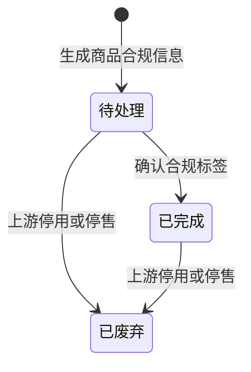

# 全局说明

### 来源范围

来源页面：「商品合规管理」。

不在本轮范围：「合规流程新整理」。

### 状态变更

商品合规信息状态：

合规标签状态：

| 状态 | 原型说明 |
| --- | --- |
| 待处理 | 初始未进行任何操作的状态 |
| 待复核 | 已操作「匹配标签规则」，已生成标签还未复核的状态 |
| 已复核 | 已操作「生成合规标签」，已复核的状态 |
| 无需标签 | 已操作「匹配标签规则」，匹配为无需合规标签 |

合规报告状态：

| 状态 | 原型说明 |
| --- | --- |
| 待处理 | 合规工程师未做任何操作的初始状态 |
| 待上传 | 非特采且商品绑定的报告状态为「待上传」 |
| 待审批 | 非特采且商品绑定的报告状态为「待审批」 |
| 已驳回 | 非特采且商品绑定的报告状态为「已驳回」 |
| 已上传 | 非特采且商品绑定的报告状态为「已上传」 |
| 无需报告 | 商品无需上传报告 |

### 状态与操作对照

| 状态类型 | 状态 | 可执行的操作 |
| --- | --- | --- |
| 商品合规信息状态 | 所有状态 | 查看列表、操作日志、编辑备注 |
| 商品合规信息状态 | 待处理 | 关联合规报告、匹配标签规则、生成合规标签、确认合规标签 |
| 商品合规信息状态 | 已完成 | 查看列表、操作日志 |
| 商品合规信息状态 | 已废弃 | 查看列表、操作日志 |
| 合规标签状态 | 待处理 | 匹配标签规则、生成合规标签 |
| 合规标签状态 | 无需标签 | 完结状态 |
| 合规标签状态 | 待复核 | 匹配标签规则、生成合规标签、确认合规标签 |
| 合规标签状态 | 已复核 | 匹配标签规则、生成合规标签 |
| 合规报告状态 | 待处理 | 关联合规报告 |
| 合规报告状态 | 无需报告 | 完结状态 |
| 合规报告状态 | 已上传 | 完结状态 |

### 通用规则

【商品合规信息状态】默认「待处理」。
【合规标签状态】默认「待处理」。
【合规报告状态】默认「待处理」。
【实际完成时间】状态变更为「已完成」的时间，只记录首次。
「核对合规标签」「预览合规标签」在原型中出现入口或按钮，但未展开字段、校验或执行规则，不单独生成 PRD，规则待确定。
列表行「产品详情」在原型中出现入口，但未展开页面，不单独生成 PRD，跳转对象待确定。
