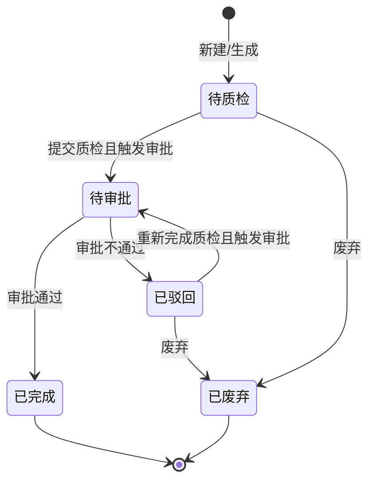
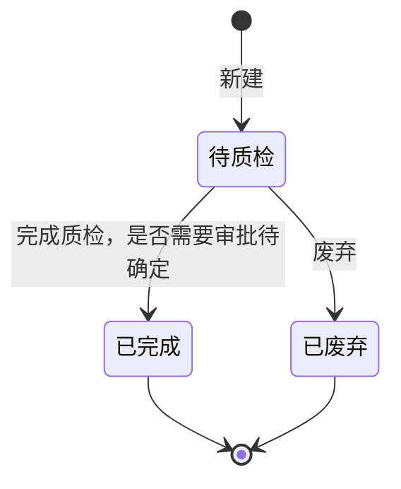

# 质检单-全局说明

### 状态变更
大货质检单

新品质检单

### 状态与操作对照
大货质检单

| 状态 | 可执行的操作 |
| --- | --- |
| 所有状态 | 详情 |
| 待质检 | 质检、修改质检排期、废弃 |
| 已驳回 | 完成质检、修改质检排期、废弃 |
| 待审批 | 审批、废弃 |
| 已完成 | 打印 |
| 已废弃 | - |

新品质检单

| 状态 | 可执行的操作 |
| --- | --- |
| 所有状态 | 详情 |
| 待质检 | 质检、修改质检排期、废弃 |
| 已废弃 | - |
| 已完成 | - |

