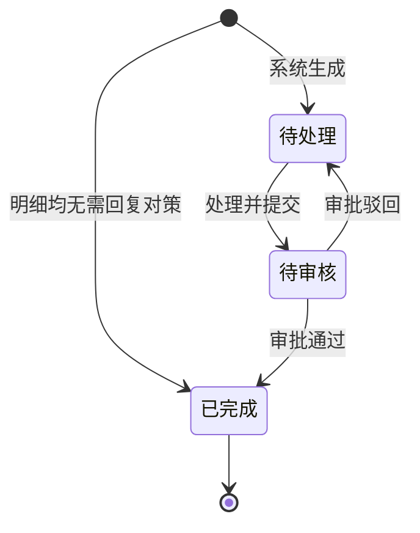

# 全局说明

### 状态变更

### 状态与操作对照

| 状态 | 可执行的操作 |
| --- | --- |
| 所有状态 | 详情、日志、导出 |
| 待处理 | 处理 |
| 待审核 | 日志 |
| 已完成 | 日志 |

### 通用规则

状态枚举以「待处理」「待审核」「已完成」为准；原型字段说明中出现「待审批」，与列表展示的「待审核」命名不一致，后续需统一。
「质检异常跟进单」由上游「样品评估报告详情」「质检单（大货-详情）」「质检单（新品-详情）」进入数据生成，不支持在本页面手工新建。
同一批进入数据按【Msku(库存SKU)】、【供应商】、【责任方】分组生成跟进单。
【跟进单号】按 `FU+年月日+供应商编号+两位自增序列号` 生成。
【返工次数】取关联审批单被驳回次数。
【最晚处理时间】按【创建时间】加自定义配置时效计算。
【是否逾期处理】当【处理时间】大于【最晚处理时间】时为「是」，其他情况为「否」。
「日志」记录项包括「处理」「审批」；日志弹窗字段未在原型中展开，暂记为待确定。
