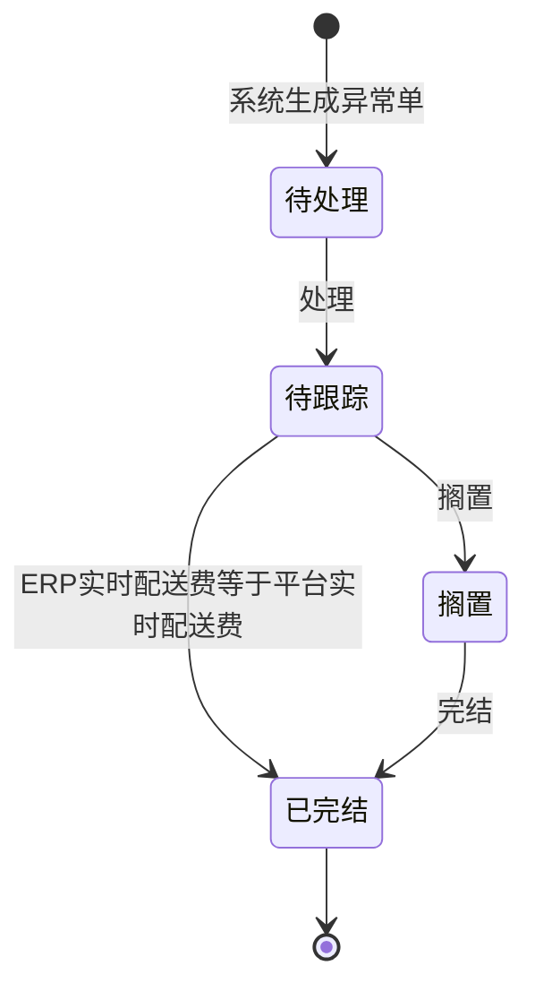

# 全局说明

### 业务范围

「FBA费异常管理」用于管理成本核算配送费与商品列表平台配送费不一致生成的异常单。
列表默认按照【创建时间】倒序展示。
页面包含状态页签「待处理」「待跟踪」「搁置」「已完结」「全部」。

### 状态变更

### 状态与操作对照

| 状态 | 可执行的操作 |
| --- | --- |
| 所有状态 | 查看、编辑索赔金额、编辑Case ID、编辑客服备注、日志 |
| 待处理 | 处理 |
| 待跟踪 | 处理方式、生成跟进单、搁置 |
| 搁置 | 完结 |
| 已完结 | 查看、日志 |

### 通用规则

【异常单号】系统生成，规则为「FYC+年月日+4位自增序号」。
【异常单唯一值】按「平台+库存SKU+销售国」判断。
【状态】枚举为「待处理」「待跟踪」「搁置」「已完结」。
【状态】默认值为「待处理」。
【平台售价(本币)】取商品列表对应售价，存表后不再更新。
【ERP实时配送费】实时查询成本核算的【配送费】；当【状态】为「已完结」时不再更新。
【平台实时配送费】实时查询商品列表的【配送费】；当【状态】为「已完结」时不再更新。
【配送费差异】按【平台配送费】-【ERP配送费】计算。
【销量】取【创建时间】对应的总销量；当【ERP实时配送费】与【平台实时配送费】相等时不再统计。
【总差异金额】按【配送费差异】×【销量】计算。
【异常初步判断】当ERP规格与平台规格相同但收费档位不同时为「费用异常」。
【异常初步判断】当ERP规格与平台规格不同且收费档位不同时为「规格异常」。
【异常原因】为手动选择信息，需要做成字段管理，枚举值待确定。
【异常处理方式】为手动选择信息，需要做成字段管理，枚举值待确定。
【品质人员(QE)】根据产品分类到业务配置的品质配置中匹配QE分类分工，具体匹配规则待确定。
【跟进单状态】通过【异常单号】获取「FBA费异常跟进单」最新跟进单状态。
【跟进单信息】通过【异常单号】获取「FBA费异常跟进单」最新跟进单信息。
【完结时间】记录【状态】变更为「已完结」的时间。
批量操作时，所选数据状态必须一致；不一致时提示「选择的数据中状态需要相同才允许批量处理，请检查后重新选择。」。
所有可操作按钮需要记录操作日志，日志需要记录每次新增、编辑、删除，日志字段待确定。
