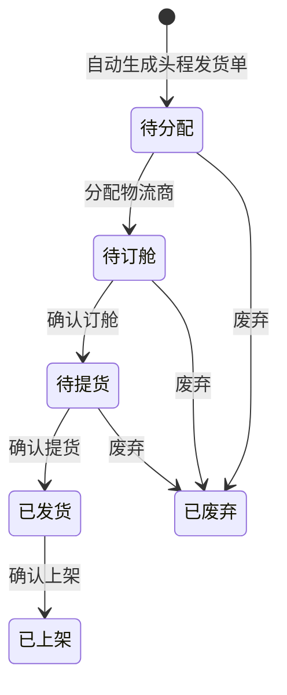

# 全局说明

### 状态变更

### 状态与操作对照

| 状态 | 可执行的操作 |
| --- | --- |
| 所有状态 | 详情 |
| 待分配 | 分配物流商、分配OA信息、分配物流人员、编辑舱位信息、编辑提货信息、编辑资料信息 |
| 待订舱 | 分配OA信息、分配物流人员、分配物流商信息、编辑舱位信息、编辑提货信息、编辑资料信息、生成报关单/更新报关单、导出发票资料、导出商检资料、录入计提费用 |
| 待提货 | 编辑舱位信息、编辑提货信息、编辑资料信息、生成报关单/更新报关单、导出发票资料、导出商检资料、录入计提费用 |
| 已发货 | 录入物流日志、拦截、导出发票资料、导出商检资料、编辑资料信息、生成税金登记、录入实际费用 |
| 已废弃 | - |

### 通用规则

【发货单号】五位数字，自增1，从10001开始
【标签】包含「变更」「税金异常」「拦截」，「税金异常」在出库后生成税金登记失败时展示，重新生成后消失；存在拦截数据时展示「拦截」标识
【定柜时间】默认等于调柜单明细最迟货好时间+3，修改货好时间需要同步更新并通知对应物流人员和主管
【最晚提货时间】查询调柜单数据
【实际出库时间】在确认提货时记录操作时间
【创建时间】取首次确认时间
计提费用操作适用于「待订舱」「待提货」且未确认计提的数据
实际费用操作适用于已确认计提且实际费用未确认的数据
权限控制、审批流和消息通知渠道待确定
