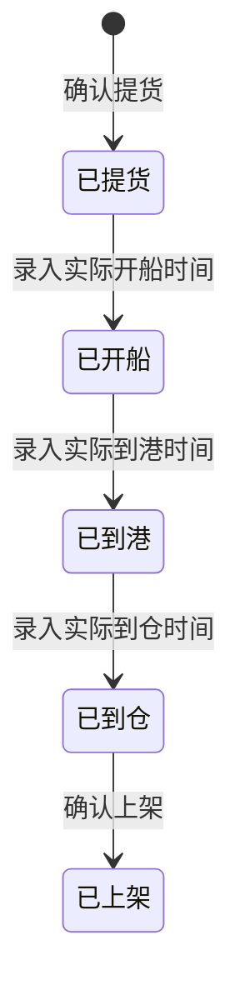

# 全局说明

### 状态变更

### 状态与操作对照

| 状态 | 可执行的操作 |
| --- | --- |
| 所有状态 | 详情、录入物流日志 |
| 已提货 | 录入物流轨迹 |
| 已开船 | 录入物流轨迹 |
| 已到港 | 录入物流轨迹 |
| 已到仓 | 录入物流轨迹、确认上架 |
| 已上架 | 录入物流日志 |

### 通用规则

列表默认按照【提货日期】倒序排列
涉及标红的字段均为时效字段，当【实际时效】大于【预计时效】时标红实际时效
当状态变更为「已上架」时，不展示「录入物流轨迹」按钮
修改时间后即时保存，无法二次修改
