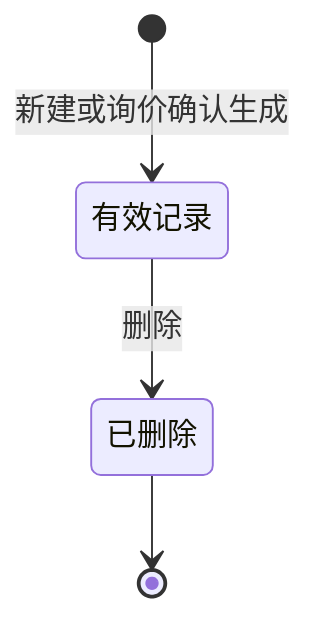

# 全局说明

### 业务范围

「头程费用标准」用于维护物流商在不同国家、运输方式、仓库、柜型、是否OA和费用有效期下的头程费用标准。
列表默认按照【创建时间】倒序展示。
费用标准支持「手动创建」和「询价创建」两种创建方式。

### 状态变更

原型未展示独立业务状态。

### 状态与操作对照

| 状态 | 可执行的操作 |
| --- | --- |
| 有效记录 | 详情、编辑、删除、复制、导出、导入 |
| 已删除 | - |

### 通用规则

【创建方式】枚举为「询价创建」「手动创建」。
【创建方式】为「询价创建」时，【询价单号】展示对应询价单号。
【创建方式】为「手动创建」时，【询价单号】为空。
【计费信息】基于【发货仓】和【目的仓】排列组合生成。
【费用项】基于头程费用模板展示，只取【是否询价】为「是」的费用项。
【费用项】基于不同【询价模式】展示不同列表头，原型展示模式包括「按票」「按体积」「按重量」「按商检报关单」「按报关单」。
【费用项金额】为数值输入，允许输入0和正数，小数点最多两位。
【物流商】取启用的物流商。
【国家】基于费用模板启用的国家进行选择。
【运输方式】在选择【国家】后，从费用模板中取该国家启用的运输方式；未选择国家时为空，切换国家后清空。
【柜型】从字典「柜型」中取值。
【是否OA】枚举为「是」「否」。
【发货仓】取所有启用的「自营仓」。
【目的仓】取所有启用的FBA仓、WFS仓、三方仓。
导出按原表导出，字段为费用项。
导入基于原表导入，导入时后端校验表头需要一致；校验成功后将值返回前端。
