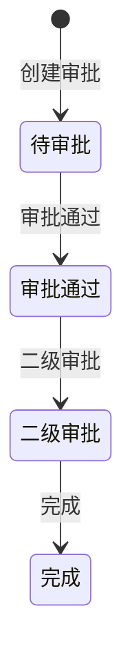

# 全局说明

### 状态变更

### 状态与操作对照

| 状态 | 可执行的操作 |
| --- | --- |
| 待审批 | 催办 |
| 已催办 | - |
| 完成 | - |

### 通用规则

页面展示废弃报关单审批信息、报关单基础信息和审批流程节点
「催办」点击后弹出确认气泡，确认后按钮变为「已催办」
审批同意、驳回、二级审批的具体按钮和执行规则未在原型中明确，待确定
