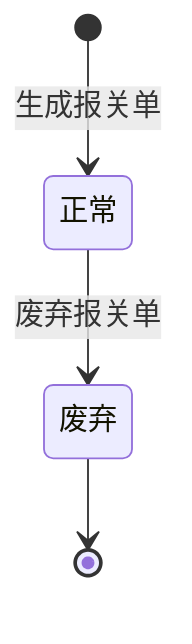

# 全局说明

### 状态变更

### 状态与操作对照

| 状态 | 可执行的操作 |
| --- | --- |
| 所有状态 | 详情 |
| 正常 | 编辑、废弃 |
| 废弃 | - |

### 通用规则

【报关单状态】默认为「正常」，废弃后展示为「已废弃」或「废弃」，列表样例展示「废弃」
【标签】当报关单废弃审批单未完成时展示「审批中」
【报关单号】自动生成，格式为 `yyyymmdd+HS+{年序列号}`，【年序列号】每年从001开始，默认3位，自增1，超过位数后自动增加位数
「编辑」入口进入「编辑报关资料」页面，编辑字段和保存规则见「报关资料」业务对象
报关单生成和更新规则见「头程发货单」业务对象的「操作-生成更新报关单」
