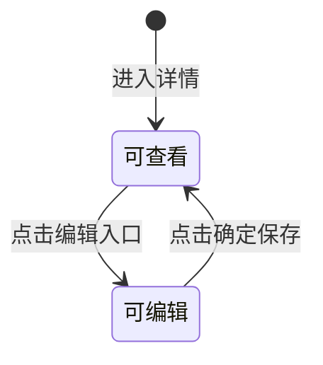

# 全局说明

### 状态变更

### 状态与操作对照

| 状态 | 可执行的操作 |
| --- | --- |
| 可查看 | 导出本页资料、导出多页资料 |
| 可编辑 | 编辑订舱单、编辑报关单、编辑申报要素、确定 |

### 通用规则

报关资料详情页包含「订舱单」「报关单」「申报要素」「装箱单」「发票」「合同」「存仓委托书」「型号清单」「代理报关委托书」「货物运输单」
编辑报关资料页包含「编辑订舱单」「编辑报关单」「编辑申报要素」
详情页展示的印章包括【境内发货人的公章】【境外收货人的公章】【名称章】，印章来源和缺失处理待确定
编辑页中未出现输入控件的展示字段按只读处理，是否支持编辑待确定
