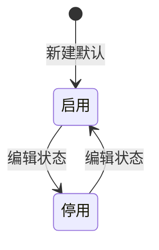

# 全局说明

### 状态变更

### 状态与操作对照

| 状态 | 可执行的操作 |
| --- | --- |
| 所有状态 | 详情、编辑 |
| 启用 | 删除 |
| 停用 | 删除 |

### 通用规则

【物流商类型】区分「国际物流商」和「国内物流商」，页面顶部通过类型切换展示不同列表和新建入口
【状态】枚举为「启用」「停用」，新建默认「启用」
【物流商编号】创建后不允许修改
列表按照【创建时间】倒序排列
「详情」展示字段来自新建/编辑信息，详情页无独立提交规则
「导出」未在原型中展示，导出规则待确定
权限控制、操作日志字段、删除后的关联影响待确定
