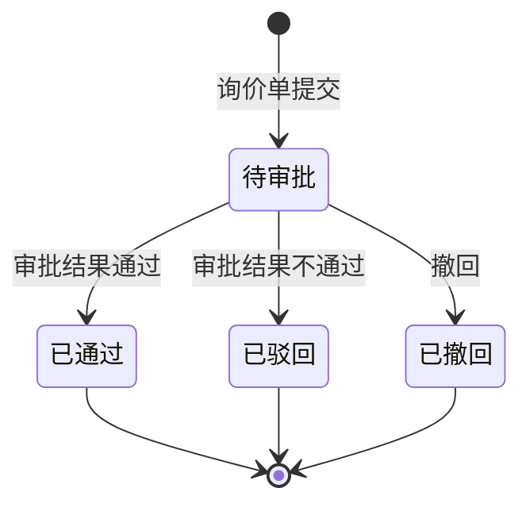

# 全局说明

### 业务范围

「询价审批」用于展示询价单审批详情、审批流程、业务单据信息，并支持审批、催办和撤回相关操作。
审批详情中展示询价单基础信息、询价物流商明细和审批流节点。

### 状态变更

### 状态与操作对照

| 状态 | 可执行的操作 |
| --- | --- |
| 所有状态 | 详情 |
| 待审批 | 审批、催办 |
| 待审批且未被第一个审批人审批 | 撤回 |
| 已通过 | - |
| 已驳回 | - |
| 已撤回 | - |

### 通用规则

【审批单号】由系统生成，原型示例为「SPD240101001」，生成规则待确定。
【业务单号】关联询价单号。
【审批名称】展示审批名称，取值规则待确定。
【摘要】展示审批摘要，取值规则待确定。
【发起人】取提交询价审批的用户。
【发起时间】取提交审批时间。
【审批流程】展示节点名称、审批人、处理时间、审批意见，节点包括「创建审批」「审批通过」「二级审批」「完成」等，实际节点配置待确定。
【审批通知固定标签】包含【询价单号】【询价模式】【柜型】【是否OA】【发货仓】【目的仓】。
原型撤回说明中出现「质检单列表」字样，本模块按「询价单列表」理解，最终以业务确认口径为准。
