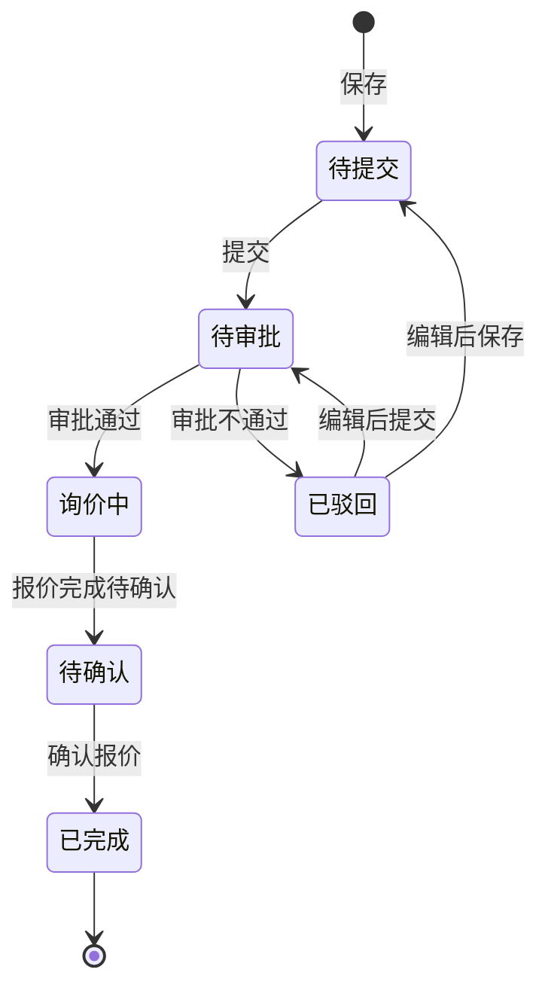

# 全局说明

### 业务范围

「询价管理」用于创建物流运费询价单、维护询价基础信息、查看物流商报价进度，并在报价确认后同步生成「头程费用标准」。
列表默认按照【创建时间】倒序展示。
页面包含状态页签「待提交」「待审批」「询价中」「待确认」「已驳回」「已完成」。

### 状态变更

### 状态与操作对照

| 状态 | 可执行的操作 |
| --- | --- |
| 所有状态 | 详情、复制 |
| 待提交 | 编辑、删除 |
| 已驳回 | 编辑、删除 |
| 待审批 | 审批 |
| 询价中 | - |
| 待确认 | 确认报价 |
| 已完成 | - |

### 通用规则

【询价单号】由系统生成，生成规则待确定。
【询价物流商】展示所有询价物流商，鼠标移入支持查看邮件发送状况。
【询价物流商】中邮件发送失败的物流商可点击「再次发送」；点击后按钮置灰，直至刷新页面。
【询价物流商】再次发送后若仍然失败，仍展示「再次发送」按钮，用户可再次点击发送。
【已报价物流商】统计询价单关联报价单中状态变为「已报价」的数量。
【询价物流商】基于用户选择的【询价模式】自动展示，需要剔除禁用状态物流商。
【询价物流商】当用户切换【询价模式】时，需要重新展示。
【询价模式】基于费用模板启用的【起运国】【目的国】【运输方式】进行选择。
【运输方式】在用户未选择国家时为空；用户选择国家和运输方式后切换国家，需要清空【运输方式】。
【柜型】从字典「柜型」中取值。
【是否OA】枚举为「是」「否」。
【发货仓】取所有启用的「自营仓」。
【目的仓】取所有启用的FBA仓、WFS仓、三方仓。
【报价有效期】选择时限制结束日期不能早于当前日期，不满足时前端标红提示。
【报价截止日期】选择时限制不能早于当前日期，不满足时前端标红提示。
【备注】不限制字符类型，最多500字符。
「复制」入口已展示，复制后的字段带入、状态和校验规则待确定。
