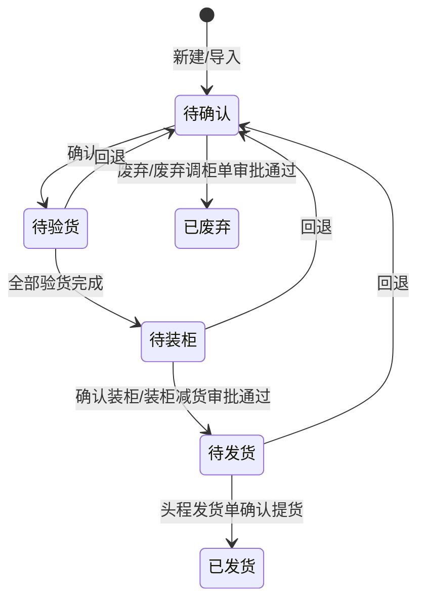

# 全局说明

来源页面：`调柜单.html`

### 状态变更

回退目标状态原型说明区写为「待确认」，弹窗文案写为「待确定」，目标状态标记为「待确定」。

### 状态与操作对照

| 状态 | 可执行的操作 |
| --- | --- |
| 所有状态 | 详情 |
| 待确认 | 编辑、确认、废弃；存在头程发货单时展示「调柜变更」 |
| 待验货 | 回退 |
| 待装柜 | 确认装柜、回退 |
| 待发货 | 更新装柜、回退 |
| 已发货 | - |
| 已废弃 | - |

### 通用规则

【调柜单号】自动生成，规则为「TGD + yymmdd + 三位日序列号」，序列号跨日清零，从 1 开始
【总箱数】取调柜单所有明细箱数之和
【总体积】取调柜单所有明细体积之和
【总重量】取调柜单所有明细重量之和
调柜单存在状态为「待提交」或「待审批」的调柜变更单时，调柜单展示「变更中」标签
调柜单存在未完结调柜变更单时，不允许重复发起调柜变更、确认装柜、回退、废弃等受影响操作
涉及调柜明细变更后，需要重新覆盖【实际调柜数】为实际调度数，统计时剔除已废弃的调度需求
