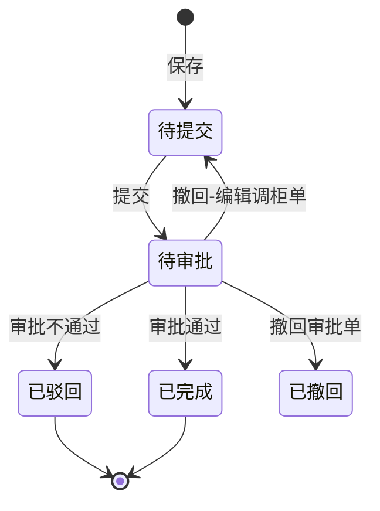

# 全局说明

来源页面：`调柜变更单.html`、`审批调柜变更单.html`

### 状态变更

【变更类型】为「废弃调柜单」或「确认装柜减货」时，撤回会真删调柜变更单数据；是否仍保留业务状态记录待确定。

### 状态与操作对照

| 状态 | 可执行的操作 |
| --- | --- |
| 所有状态 | 详情 |
| 待提交 | 编辑、删除、提交 |
| 待审批 | 审批 |
| 已驳回 | 删除 |
| 已完成 | - |
| 已撤回 | 审批单撤回后产生，列表是否展示待确定 |

### 通用规则

【调柜变更单号】自动生成，具体编号规则待确定
【变更类型】枚举包含「编辑调柜单」「调柜单装柜减货」「废弃调柜单」
调柜变更单状态为「待提交」或「待审批」时，视为未完结
同一调柜单存在未完结调柜变更单时，不允许再次发起调柜变更
审批通过后，按照调柜变更单数据覆盖原始调柜单数据
审批通过后推送确认调柜单事件；推送成功则成功，推送失败则跳过，无需提示
